# BÁO CÁO KHẢO SÁT QUY TRÌNH NGHIỆP VỤ THỰC TẾ & XÁC ĐỊNH ĐIỂM NGHẼN
## Task ID: [BA-01] | Đồ án môn học: Quản lý Dự án Phần mềm
**Hệ thống:** CRM Quản lý Tuyển sinh và Đào tạo cho Trung tâm Anh ngữ  
**Đơn vị thực hiện:** Nhóm 8  
**Ngày hoàn thành:** 28/09/2026  
**Trạng thái:** Hoàn thành (Review & Deliverable Ready)

---

## 1. THÔNG TIN CHUNG & MỤC TIÊU KHẢO SÁT

### 1.1. Bối cảnh
Các trung tâm Anh ngữ hiện nay có quy mô từ vừa đến lớn thường vận hành song song hai mảng cốt lõi: **Tuyển sinh (Sales / Marketing)** và **Đào tạo học thuật (Academic Operations)**. Tuy nhiên, phần lớn các trung tâm vừa và nhỏ vẫn sử dụng các công cụ thủ công rời rạc như: bảng tính Excel/Google Sheets cá nhân, ứng dụng chat Zalo, sổ tay ghi chép và lịch treo tường.

### 1.2. Mục tiêu tài liệu
* **Mô tả chi tiết bức tranh hiện trạng (AS-IS):** Làm rõ cách thức trung tâm đang tiếp nhận khách hàng tiềm năng (Lead), chăm sóc tư vấn, tổ chức thi xếp lớp và thu học phí.
* **Xác định các điểm nghẽn nghiêm trọng (Pain Points Analysis):** Phân tích nguyên nhân gốc rễ (Root Cause) và tổn thất kinh doanh do quy trình thủ công gây ra.
* **Định hình mô hình mục tiêu (TO-BE Solution):** Đề xuất các giải pháp công nghệ trên nền tảng Web App CRM nhằm tối ưu hóa tỷ lệ chuyển đổi, giảm thiểu sai sót dữ liệu và minh bạch hóa vận hành.

---

## 2. KHẢO SÁT HIỆN TRẠNG QUY TRÌNH NGHIỆP VỤ (AS-IS)

Quy trình vận hành thực tế tại trung tâm Anh ngữ trải qua 5 giai đoạn liên tiếp:

```
[Tiếp nhận Lead] ──> [Tư vấn & Chăm sóc] ──> [Hẹn & Thi Placement Test] ──> [Tư vấn Lộ trình & Xếp lớp] ──> [Đóng phí & Nhập học]
```

### 2.1. Giai đoạn 1: Thu thập và Phân bổ Lead (Lead Capture & Assignment)
* **Kênh tiếp nhận:**
  * Kênh Digital: Fanpage Facebook, Form đăng ký trên Website/Landing Page, Chiến dịch chạy quảng cáo Google Ads.
  * Kênh Truyền thống: Khách hàng gọi hotline trực tiếp, phụ huynh đến văn phòng trung tâm (Walk-in), học viên cũ giới thiệu (Referral).
* **Hình thức lưu trữ hiện tại:**
  * Nhân viên trực page xuất file `.csv` từ Facebook Lead Form hoặc copy thông tin từ tin nhắn chat rồi dán vào một file Google Sheet tổng.
  * Trưởng nhóm Tuyển sinh (Sales Leader) chia lead thủ công cho từng Tư vấn viên bằng cách phân chia từng dòng trong Excel.

### 2.2. Giai đoạn 2: Tư vấn & Nuôi dưỡng Lead (Lead Nurturing)
* **Hình thức thao tác:**
  * Mỗi Tư vấn viên (Sales) tự tạo một file Excel riêng trên máy tính cá nhân để lưu danh sách lead được giao.
  * Tư vấn viên gọi điện tư vấn nhu cầu (giao tiếp, thi chứng chỉ IELTS, TOEIC, học cấp tốc).
  * Lịch sử cuộc gọi, mức độ tiềm năng (Nóng/Ấm/Lạnh), ghi chú về kỳ vọng học viên được ghi vắn tắt vào các cột "Ghi chú 1", "Ghi chú 2" trong file cá nhân.
  * Nhắc lịch gọi lại (Follow-up) hoàn toàn phụ thuộc vào trí nhớ hoặc giấy ghi chú (Sticky Notes) của từng nhân viên.

### 2.3. Giai đoạn 3: Hẹn lịch & Tổ chức kiểm tra trình độ (Placement Test)
* **Quy trình hẹn:**
  * Khi khách hàng đồng ý kiểm tra đầu vào, Tư vấn viên hỏi giờ rảnh của khách, sau đó nhắn tin qua Zalo nội bộ hỏi Giáo vụ xem phòng thi và giáo viên có trống vào khung giờ đó hay không.
  * Nếu trống, Giáo vụ xác nhận qua tin nhắn và ghi lịch vào một file Excel "Lịch Test Trung Tâm".
* **Quy trình tổ chức thi:**
  * Học viên đến làm bài kiểm tra giấy gồm 3 kỹ năng: Nghe (Listening), Đọc (Reading), Viết (Writing) và 1 buổi phỏng vấn Nói (Speaking) 10–15 phút với giáo viên bản ngữ/giáo viên Việt Nam.
  * Giáo viên chấm điểm trên phiếu chấm giấy (Scorecard paper).
  * Cuối ngày, Giáo vụ thu lại các phiếu giấy và nhập điểm số vào file tổng kết. Sau đó thông báo điểm cho Tư vấn viên qua tin nhắn chat.

### 2.4. Giai đoạn 4: Tư vấn Lộ trình & Xếp lớp (Course Recommendation & Enrollment)
* Dựa trên kết quả test (ví dụ: Band 4.5 IELTS), Tư vấn viên tư vấn khóa học phù hợp (ví dụ: Khóa IELTS Target 5.5 - 6.0).
* Tư vấn viên tra cứu danh sách lớp sắp khai giảng trên file "Kế hoạch mở lớp" của Giáo vụ để tìm lớp có lịch học (Thứ 2-4-6 hoặc Thứ 3-5-7) phù hợp với học viên.
* **Xung đột xảy ra:** Nhiều tư vấn viên cùng nhắm vào một lớp học còn ít chỗ trống mà không biết đồng nghiệp khác cũng đang chuẩn bị chốt học viên vào lớp đó.

### 2.5. Giai đoạn 5: Thu học phí & Chuyển đổi thành Học viên chính thức
* Khách hàng nộp học phí qua chuyển khoản ngân hàng hoặc tiền mặt tại quầy.
* Kế toán/Lễ tân viết biên lai giấy và chụp ảnh ủy nhiệm chi gửi vào nhóm chat chung.
* Giáo vụ mở file Excel "Danh sách học viên chính thức" của lớp tương ứng, gõ tay thông tin học viên vào danh sách sĩ số lớp.

---

## 3. BẢNG PHÂN TÍCH MA TRẬN ĐIỂM NGHẼN (PAIN POINTS MATRIX)

Qua khảo sát thực tế, nhóm đã tổng hợp và phân tích **6 điểm nghẽn nghiêm trọng nhất** đang cản trở sự phát triển của trung tâm:

| Mã | Điểm nghẽn thực tế (Pain Point) | Nguyên nhân gốc rễ (Root Cause) | Hậu quả & Tổn thất kinh doanh (Business Impact) | Mức độ | Giải pháp số hóa trên CRM |
| :---: | :--- | :--- | :--- | :---: | :--- |
| **PP-01** | **Thất thoát và trùng lặp Lead** | Dữ liệu thu thập từ nhiều kênh (FB, Web, Hotline) không được đổ về một kho tập trung; không có cơ chế kiểm tra trùng lặp số điện thoại. | - Lead bị bỏ quên không được gọi kịp thời.<br>- Khách hàng bị 2 tư vấn viên khác nhau cùng gọi tư vấn, gây phản cảm.<br>- Tỷ lệ chuyển đổi giai đoạn đầu giảm 25-30%. | 🔴 **Critical** | **Lead Pipeline tập trung:** Hệ thống tự động thu thập lead, tự động kiểm tra trùng lặp qua SĐT/Email và phân bổ tự động cho Sales theo cơ chế Round-robin. |
| **PP-02** | **Mất dấu lịch sử tương tác chăm sóc khách hàng** | Mỗi Tư vấn viên ghi chép lịch sử gọi điện trên file Excel cá nhân hoặc trí nhớ riêng; không có nhật ký hoạt động chung. | - Khi nhân viên nghỉ việc hoặc nghỉ ốm, toàn bộ dữ liệu chăm sóc khách hàng bị gián đoạn.<br>- Nhân viên mới tiếp quản phải hỏi lại từ đầu khiến khách hàng mất thiện cảm. | 🔴 **Critical** | **Interaction Timeline / Log:** Lưu vết toàn bộ lịch sử tư vấn, ghi chú, trạng thái cuộc gọi gắn liền với hồ sơ Lead theo thứ tự thời gian. |
| **PP-03** | **Xung đột lịch & Rời rạc trong khâu Placement Test** | Đặt lịch test qua tin nhắn Zalo/miệng; kết quả thi lưu trên giấy rồi mới gõ lại vào máy tính; mất liên kết dữ liệu giữa bài test và hồ sơ Lead. | - Trùng giờ thi của giáo viên chấm Speaking.<br>- Kết quả trả về chậm (1-2 ngày) làm giảm nhiệt huyết chốt khóa học của học viên. | 🟠 **High** | **Module Đặt lịch & Nhập điểm Test:** Tự động kiểm tra slot trống theo khung giờ; cho phép Giáo vụ nhập trực tiếp điểm số 4 kỹ năng; hệ thống tự động gợi ý level lớp phù hợp. |
| **PP-04** | **Xếp lớp thủ công, dễ vượt sĩ số (Overbooking)** | Quản lý sĩ số lớp bằng Excel độc lập; Sales và Giáo vụ không có cùng góc nhìn thời gian thực về số chỗ còn lại trong lớp. | - Lớp học bị quá tải số lượng học viên tối đa (vượt sĩ số phòng học).<br>- Tình trạng hủy lớp hoặc phải chuyển học viên sang lớp khác gây bức xúc. | 🟠 **High** | **Real-time Class Capacity & Enrollment:** Quản lý sĩ số thời gian thực (ví dụ 12/15 chỗ); tự động khóa lớp khi đủ chỉ tiêu; 1-click chuyển Lead thành Học viên chính thức. |
| **PP-05** | **Số liệu báo cáo phân tán, chậm trễ và thiếu minh bạch** | Quản lý phải chờ đến cuối tuần hoặc cuối tháng để kế toán và các tư vấn viên gộp báo cáo từ hàng chục file Excel. | - Không nắm bắt được hiệu suất chốt sale thực tế của từng nhân sự.<br>- Không phân tích được tỷ lệ rơi rụng (Drop-off rate) ở từng bước trong phễu tuyển sinh để tối ưu chi phí Marketing. | 🟡 **Medium** | **Dashboard Báo cáo Real-time:** Thống kê phễu chuyển đổi (Lead $\rightarrow$ Test $\rightarrow$ Chốt), xếp hạng doanh thu tư vấn viên và tỷ lệ lấp đầy sĩ số các lớp. |
| **PP-06** | **Rủi ro rò rỉ dữ liệu khách hàng (Data Security Risk)** | File Excel chứa toàn bộ họ tên, số điện thoại phụ huynh/học viên được tải tự do về laptop cá nhân hoặc lưu trữ trên Google Drive cá nhân của nhân viên. | - Nguy cơ nhân viên mang tệp khách hàng sang trung tâm đối thủ khi chuyển việc.<br>- Vi phạm quy định bảo mật thông tin cá nhân của người học. | 🟠 **High** | **Phân quyền người dùng (RBAC):** Nhân viên chỉ xem được khách hàng do mình quản lý; kiểm soát quyền tải xuất dữ liệu (Export) chỉ dành riêng cho Admin/Manager. |

---

## 4. MÔ HÌNH SO SÁNH AS-IS (HIỆN TẠI) VÀ TO-BE (KHI CÓ WEB CRM)

```mermaid
graph TD
    subgraph "QUY TRÌNH THỦ CÔNG (AS-IS)"
        A1[Lead từ nhiều nguồn] -->|Copy-paste rời rạc| A2[Excel cá nhân của từng Sales]
        A2 -->|Chat Zalo hỏi lịch test| A3[Lịch giấy & Excel của Giáo vụ]
        A3 -->|Chấm giấy & Gõ tay| A4[File điểm rời rạc]
        A4 -->|Hỏi miệng về sĩ số| A5[File sĩ số lớp học]
        A5 -->|Cuối tháng gộp tay| A6[Báo cáo chậm trễ & Sai số]
    end

    subgraph "QUY TRÌNH SỐ HÓA CRM (TO-BE)"
        B1[Lead từ Web/Form/Hotline] -->|Tự động đổ vào| B2[(Hệ thống CRM Tập trung)]
        B2 --> B3[Pipeline Lead Kanban: Phân bổ & Lưu Log tương tác]
        B3 --> B4[Lịch Test Thông minh: Tự động check slot & Lưu điểm 4 kỹ năng]
        B4 --> B5[Xếp lớp Real-time: Gợi ý lớp theo điểm & Khóa sĩ số]
        B5 --> B6[Dashboard Real-time: Báo cáo tỷ lệ chuyển đổi & Doanh số]
    end
```



### So sánh chỉ số kỳ vọng:
| Tiêu chí | Mô hình hiện tại (AS-IS) | Mô hình Web CRM (TO-BE) | Mục tiêu cải thiện |
| :--- | :--- | :--- | :--- |
| **Thời gian phản hồi Lead mới** | 4 – 12 giờ | Dưới 15 phút | Giảm 85% thời gian chờ |
| **Thời gian trả kết quả Placement Test** | 24 – 48 giờ | Ngay sau khi giáo viên nhập điểm (Real-time) | Tăng 40% khả năng chốt hợp đồng ngay |
| **Tỷ lệ thất thoát Lead** | ~20% – 30% | Dưới 3% | Bảo toàn tài sản data |
| **Thời gian tổng hợp báo cáo** | 2 – 3 ngày cuối tháng | Tức thời (0 giây - xem trực tiếp Dashboard) | Ra quyết định kinh doanh kịp thời |
| **Xung đột sĩ số lớp học** | Thường xuyên xảy ra (~10-15%) | 0% (Hệ thống kiểm soát capacity tự động) | Nâng cao trải nghiệm học viên |

---

## 5. KẾT LUẬN & ĐỀ XUẤT CHO CÁC TASK TIẾP THEO

Báo cáo khảo sát đã chỉ ra rằng việc xây dựng hệ thống **Web Application CRM** là hoàn toàn cấp thiết và khả thi, giải quyết triệt để các rủi ro vận hành bằng bảng tính Excel thủ công.

### Chuyển giao dữ liệu đầu vào cho Task tiếp theo:
1. **Chuyển giao cho `[BA-02]` (Sơ đồ BPMN):** Sử dụng các mốc tương tác giữa Khách hàng, Tư vấn viên và Giáo vụ trong mục 2 để vẽ sơ đồ quy trình phân làn chuẩn BPMN 2.0.
2. **Chuyển giao cho `[UML-01]` & `[SRS-01]`:** Dựa vào 6 giải pháp trong Bảng ma trận điểm nghẽn để xác định danh mục Use Case và ma trận Yêu cầu chức năng (FR).

---
*Tài liệu thuộc hồ sơ đồ án Quản lý dự án phần mềm - Sprint 1 (Foundation & Analysis) - Nhóm 8.*
