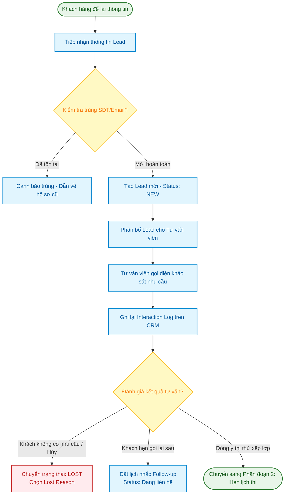
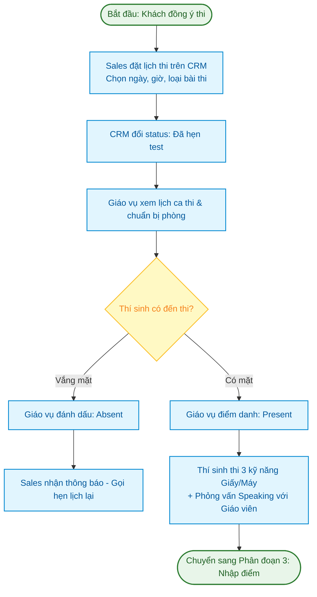
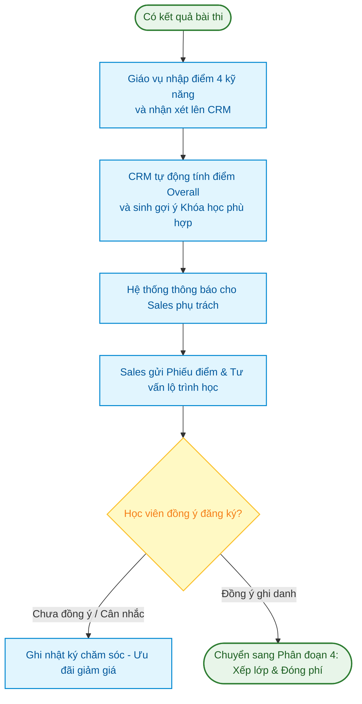
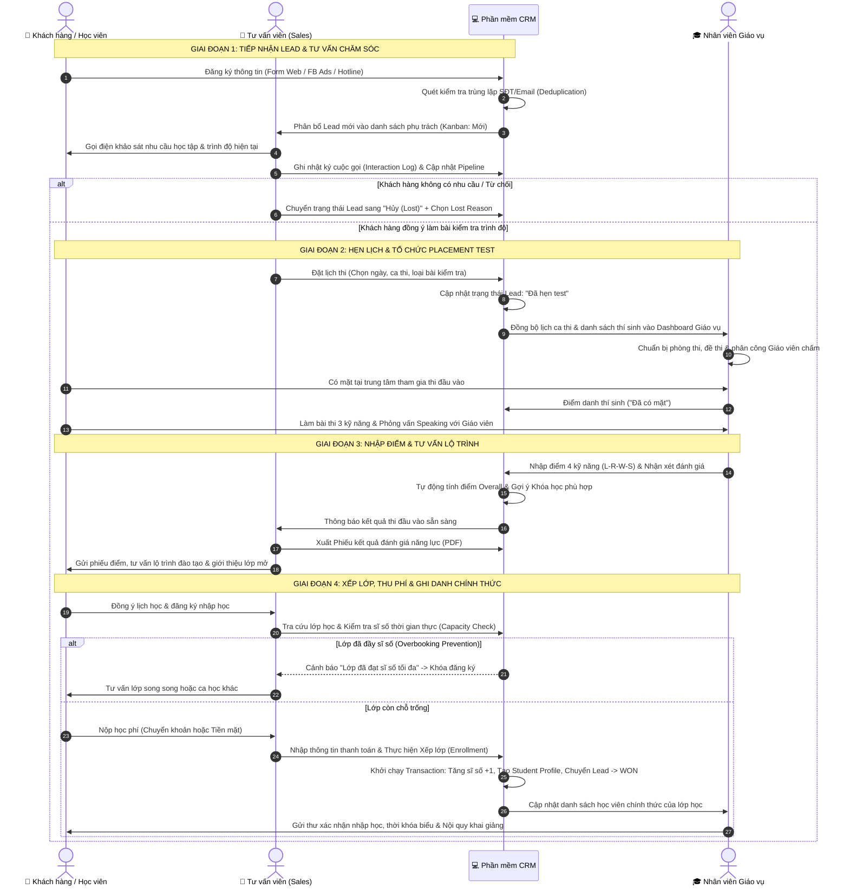

# ĐẶC TẢ SƠ ĐỒ QUY TRÌNH NGHIỆP VỤ TỔNG QUAN (BPMN 2.0 / SWIMLANE FLOW)
## DỰ ÁN: PHẦN MỀM CRM QUẢN LÝ TUYỂN SINH VÀ ĐÀO TẠO TRUNG TÂM ANH NGỮ (ENGLISH CENTER CRM)

---

| **Mã công việc** | **BA-02** |
| :--- | :--- |
| **Tên tài liệu** | Vẽ Sơ đồ quy trình nghiệp vụ tổng quan (BPMN / Swimlane Flow) |
| **Dự án** | Quản lý dự án phần mềm - Nhóm 8 |
| **Người thực hiện** | **Long Phạm** (`@longphm11`) - Business Analyst (BA) / System Analyst (SA) |
| **Người nghiệm thu** | **phong phạm** (`@phongphm2`) - Project Leader |
| **Ngày lập** | 29/09/2026 |
| **Trạng thái** | **Hoàn thành (Review & Deliverable Ready)** |
| **Tài liệu căn cứ** | `BA-01_Khao_sat_nghiep_vu_va_diem_nghen.md`, `SRS-01_Yeu_cau_chuc_nang_va_phi_chuc_nang.md`, `UML-01_Actors_va_So_do_Use_Case_tong_quan.md` |

---

## 1. MỤC TIÊU & NGUYÊN TẮC MÔ HÌNH HÓA QUY TRÌNH

### 1.1. Mục tiêu tài liệu
Tài liệu này chuẩn hóa và trực quan hóa luồng phối hợp công việc xuyên suốt giữa Khách hàng/Học viên, Tư vấn viên Tuyển sinh và Nhân viên Giáo vụ dựa trên nền tảng số hóa của hệ thống CRM. Mô hình hóa quy trình giải quyết triệt để các bất cập trong khảo sát hiện trạng `[BA-01]` (thất thoát dữ liệu, xung đột lịch test, overbooking khi xếp lớp và thiếu dấu vết chăm sóc).

### 1.2. Tiêu chuẩn mô hình hóa (BPMN 2.0 Swimlane)
Sơ đồ tuân thủ tiêu chuẩn quốc tế **BPMN 2.0 (Business Process Model and Notation)** với cấu trúc phân làn (Swimlanes):
* **Pool (Bể quy trình):** Đại diện cho toàn bộ hệ sinh thái vận hành trung tâm Anh ngữ.
* **Làn 1 - Khách hàng / Học viên (Customer / Student):** Người có nhu cầu học tập, tiếp cận thông tin, tham gia thi đánh giá năng lực, thanh toán và theo học.
* **Làn 2 - Tư vấn viên Tuyển sinh (Sales / Admissions Officer):** Tiếp nhận thông tin, tư vấn nhu cầu, theo dõi phễu Lead, đặt lịch thi xếp lớp, tư vấn khóa học và chốt ghi danh.
* **Làn 3 - Nhân viên Giáo vụ (Academic Staff):** Điều phối ca thi, nhập kết quả kiểm tra năng lực, quản lý danh mục lớp học, kiểm soát sĩ số và tiếp nhận học viên vào danh sách lớp.
* **Nền tảng số hóa (English Center CRM System):** Đóng vai trò là hạ tầng kết nối, tự động hóa luồng dữ liệu, kiểm tra ràng buộc và thông báo giữa 3 bên.

---

## 2. THIẾT LẬP CÁC LÀN SWIMLANES VÀ PHÂN ĐỊNH TRÁCH NHIỆM

```
┌────────────────────────────────────────────────────────────────────────────────────────┐
│ POOL: QUY TRÌNH QUẢN TRỊ TUYỂN SINH & ĐÀO TẠO TRUNG TÂM ANH NGỮ                       │
├────────────────────────────────────────────────────────────────────────────────────────┤
│ 👤 LANE 1: KHÁCH HÀNG / HỌC VIÊN (Customer / Student)                                 │
│   - Đăng ký nhận tư vấn, cung cấp nhu cầu cá nhân.                                     │
│   - Tham gia ca thi Placement Test đầu vào (4 kỹ năng).                               │
│   - Lựa chọn lớp học phù hợp và thanh toán học phí.                                    │
├────────────────────────────────────────────────────────────────────────────────────────┤
│ 💼 LANE 2: TƯ VẤN VIÊN TUYỂN SINH (Sales / Admissions Officer)                         │
│   - Tiếp nhận Lead, thực hiện cuộc gọi tư vấn, cập nhật nhật ký tương tác.             │
│   - Đặt lịch thi Placement Test trên CRM.                                              │
│   - Phân tích kết quả thi, tư vấn lộ trình và giới thiệu khóa học/lớp học.             │
│   - Thực hiện thao tác xếp lớp và ghi nhận thu học phí trên CRM.                       │
├────────────────────────────────────────────────────────────────────────────────────────┤
│ 🎓 LANE 3: NHÂN VIÊN GIÁO VỤ (Academic Staff / Coordinator)                           │
│   - Quản lý phòng thi, ca thi, danh sách thí sinh dự thi theo ngày.                    │
│   - Tiếp đón thí sinh, phân công giáo viên chấm, nhập điểm 4 kỹ năng & nhận xét.       │
│   - Mở lớp mới, cấu hình lịch học, phòng học, giáo viên và sĩ số tối đa.               │
│   - Duyệt học viên vào danh sách lớp chính thức và phối hợp quản lý lớp.                │
└────────────────────────────────────────────────────────────────────────────────────────┘
```

---

## 3. MÔ HÌNH HÓA CHI TIẾT 4 PHÂN ĐOẠN NGHIỆP VỤ CỐT LÕI

Chuỗi giá trị vận hành được chuẩn hóa thành 4 phân đoạn liên tiếp:

### 3.1. Phân đoạn 1: Tiếp nhận Lead và Chăm sóc/Nuôi dưỡng (Lead Capture & Nurturing)

* **Mục tiêu:** Thu thập thông tin khách hàng từ đa kênh, loại bỏ trùng lặp dữ liệu, phân bổ kịp thời cho Sales và theo dõi tiến trình tư vấn qua Kanban Pipeline.
* **Các bước nghiệp vụ:**
  1. Khách hàng để lại thông tin trên Form Website/Facebook Ads, hoặc gọi Hotline, hoặc đến trung tâm trực tiếp.
  2. Hệ thống CRM tự động kiểm tra trùng lặp (Deduplication Check) dựa trên Số điện thoại và Email:
     - Nếu *đã tồn tại*: Cảnh báo trùng lặp, mở hồ sơ cũ để ghi nhận tương tác mới, ngăn tạo data ảo.
     - Nếu *chưa tồn tại*: Tạo Lead mới trên hệ thống với trạng thái **"Mới (New)"**.
  3. Lead được phân bổ tự động theo vòng (Round-Robin) hoặc gán thủ công bởi Quản lý.
  4. Tư vấn viên thực hiện liên hệ (Gọi điện / Nhắn Zalo) trong vòng 15–30 phút:
     - Ghi nhận chi tiết vào **Nhật ký tương tác (Interaction Log)**: Thời gian, hình thức, nội dung, mức độ tiềm năng (Nóng/Ấm/Lạnh).
  5. Đánh giá nhu cầu:
     - Khách hàng không có nhu cầu / sai số: Chuyển Lead sang trạng thái **"Hủy (Lost)"** và bắt buộc chọn **Lý do thất bại (Lost Reason)**.
     - Khách hàng có nhu cầu nhưng bận: Đặt lịch hẹn gọi lại (Follow-up Date), giữ Lead ở trạng thái **"Đang liên hệ"**.
     - Khách hàng quan tâm và đồng ý kiểm tra năng lực: Chuyển sang Phân đoạn 2.



---

### 3.2. Phân đoạn 2: Hẹn lịch và Tổ chức kiểm tra trình độ (Placement Test)

* **Mục tiêu:** Chuẩn hóa quy trình đặt lịch thi minh bạch, đồng bộ dữ liệu giữa Sales và Giáo vụ, chấm điểm chính xác 4 kỹ năng.
* **Các bước nghiệp vụ:**
  1. Tư vấn viên mở giao diện CRM, tra cứu lịch thi còn chỗ trống và đăng ký ca thi cho Lead:
     - Chọn Ngày thi, Khung giờ, Hình thức thi (Online/Offline) và Loại bài thi (IELTS, TOEIC, Giao tiếp).
     - CRM tự động chuyển trạng thái Lead sang **"Đã hẹn test (Test Scheduled)"**.
  2. Nhân viên Giáo vụ theo dõi danh sách ca thi trên Dashboard Giáo vụ:
     - Chuẩn bị đề thi, phân công giáo viên phỏng vấn kỹ năng Nói (Speaking Examiner), chuẩn bị phòng thi.
  3. Ngày thi: Thí sinh đến trung tâm làm bài:
     - Giáo vụ điểm danh trên CRM: Cập nhật trạng thái **"Đã có mặt (Present)"**.
     - Nếu thí sinh vắng mặt: Cập nhật **"Vắng mặt (Absent)"** $\rightarrow$ Hệ thống gửi thông báo nhắc Sales liên hệ đặt lại lịch thi.
  4. Tổ chức làm bài kiểm tra:
     - Thí sinh làm bài thi Nghe, Đọc, Viết.
     - Giáo viên trực tiếp phỏng vấn Nói 10–15 phút và ghi điểm chấm.



---

### 3.3. Phân đoạn 3: Nhập điểm, Đánh giá năng lực và Tư vấn lộ trình học

* **Mục tiêu:** Số hóa toàn bộ phiếu kết quả thi, tự động tính điểm tổng và đề xuất khóa học phù hợp dựa trên thuật toán gợi ý của CRM.
* **Các bước nghiệp vụ:**
  1. Giáo vụ thu thập kết quả chấm từ giáo viên và nhập trực tiếp lên module **Placement Test** của CRM:
     - Điểm Listening, Reading, Writing, Speaking.
     - Nhận xét chi tiết về điểm mạnh, điểm yếu ngữ pháp, phát âm và từ vựng.
  2. Hệ thống CRM tự động xử lý:
     - Tính điểm tổng hợp (Overall Score / CEFR Level).
     - Đối chiếu với chuẩn đầu vào của danh mục khóa học để đưa ra **Khóa học gợi ý (Recommended Course)**.
  3. Tư vấn viên nhận được thông báo kết quả ngay lập tức trên hệ thống:
     - Xuất phiếu báo điểm có logo trung tâm (file PDF).
     - Thực hiện cuộc gọi hoặc hẹn gặp tư vấn lộ trình học tối ưu dựa trên mục tiêu điểm số và ngân sách của học viên.
  4. Đánh giá sự đồng thuận của học viên:
     - Học viên đồng ý lộ trình: Chuyển sang Phân đoạn 4 (Xếp lớp & Đóng học phí).
     - Học viên còn do dự: Sales ghi log theo dõi, áp dụng chính sách ưu đãi/học bổng để thuyết phục.



---

### 3.4. Phân đoạn 4: Xếp lớp, Thu học phí và Ghi danh chính thức (Enrollment & Conversion)

* **Mục tiêu:** Xếp lớp theo thời gian thực (Real-time Capacity Check), loại bỏ rủi ro vượt sĩ số (Overbooking), ghi nhận thanh toán minh bạch và chuyển đổi Lead thành Học viên chính thức.
* **Các bước nghiệp vụ:**
  1. Tư vấn viên tra cứu danh sách lớp học mở của Khóa học mục tiêu:
     - Kiểm tra lịch học (2-4-6 hoặc 3-5-7), khung giờ, giảng viên và sĩ số còn trống (ví dụ: `13/15`).
  2. Kiểm tra tính khả dụng của lớp:
     - Nếu lớp đã đủ sĩ số (`15/15`): Hệ thống tự động khóa đăng ký, Sales tư vấn lớp học khác hoặc đề xuất Giáo vụ mở lớp mới.
     - Nếu lớp còn chỗ: Chọn thao tác xếp lớp.
  3. Thu học phí và ghi nhận thanh toán:
     - Khách hàng thanh toán học phí qua Chuyển khoản ngân hàng hoặc Tiền mặt tại quầy.
     - Sales nhập thông tin thanh toán: Số tiền, hình thức, mã đối soát giao dịch ngân hàng.
  4. Hệ thống thực thi quy trình ghi danh an toàn (ACID Transaction):
     - Tăng sĩ số thực tế của lớp lên +1.
     - Tự động sinh bản ghi **Học viên chính thức (Student Profile)** với Mã học viên duy nhất (`STU-xxxx`).
     - Chuyển trạng thái Lead sang **"Đã chốt (Won / Enrolled)"**.
  5. Giáo vụ tiếp nhận học viên vào danh sách lớp, gửi email/thông báo xác nhận nhập học và lịch khai giảng cho học viên.

```mermaid
flowchart TD
    classDef startEnd fill:#e8f5e9,stroke:#2e7d32,stroke-width:2px,color:#1b5e20;
    classDef process fill:#e1f5fe,stroke:#0288d1,stroke-width:1.5px,color:#01579b;
    classDef decision fill:#fff9c4,stroke:#fbc02d,stroke-width:1.5px,color:#f57f17;
    classDef success fill:#e8f5e9,stroke:#2e7d32,stroke-width:2px,color:#1b5e20;
    classDef error fill:#ffebee,stroke:#c62828,stroke-width:1.5px,color:#b71c1c;

    Start4([Bắt đầu xếp lớp & ghi danh]):::startEnd --> PickClass[Sales chọn Lớp học theo nguyện vọng học viên]:::process
    PickClass --> CheckCapacity{Sĩ số lớp còn chỗ trống?}:::decision
    
    CheckCapacity -- "Hết chỗ (Full)" --> ClassFull[CRM khóa lớp - Báo lỗi Overbooking\nSales chọn lớp khác hoặc đề xuất mở lớp]:::error
    
    CheckCapacity -- "Còn chỗ trống" --> PayFee[Thu học phí: Tiền mặt hoặc Chuyển khoản]:::process
    PayFee --> RecordPayment[Ghi nhận giao dịch thanh toán trên CRM]:::process
    RecordPayment --> TransactEnroll[Hệ thống thực thi Transaction:\n1. Tăng sĩ số lớp +1\n2. Tạo Student Profile (Mã STU)\n3. Đổi Lead sang WON]:::process
    TransactEnroll --> FinalSync[Giáo vụ nhận danh sách lớp chính thức\nGửi thư chào mừng & Lịch khai giảng]:::success
    FinalSync --> Finish([Kết thúc quy trình tuyển sinh]):::startEnd
```

---

## 4. SƠ ĐỒ QUY TRÌNH NGHIỆP VỤ TỔNG QUAN TOÀN DIỆN (END-TO-END BPMN 2.0 SWIMLANE)

Sơ đồ dưới đây thể hiện toàn bộ quy trình phối hợp tương tác giữa 3 đối tượng trên nền tảng CRM từ điểm khởi đầu (Tiếp nhận Lead) đến điểm kết thúc (Trở thành Học viên chính thức):



---

## 5. MA TRẬN CHUYỂN GIAO THÔNG TIN VÀ HIỆN VẬT NGHIỆP VỤ (ARTIFACT HANDOVER MATRIX)

Để đảm bảo tính liên tục của dữ liệu qua từng giai đoạn, các tài liệu và thực thể dữ liệu được bàn giao giữa các bên như sau:

| Giai đoạn | Bên bàn giao | Bên tiếp nhận | Hiện vật / Bản ghi dữ liệu | Thông tin then chốt chuyển giao |
| :--- | :--- | :--- | :--- | :--- |
| **Giai đoạn 1** | Kênh tiếp thị / Khách hàng | Tư vấn viên (Sales) | **Lead Record** | Họ tên, Số điện thoại, Email, Nhu cầu học, Nguồn tiếp cận, Mức độ tiềm năng. |
| **Giai đoạn 2** | Tư vấn viên (Sales) | Nhân viên Giáo vụ | **Test Schedule Booking** | Mã Lead, Ca thi đã chọn, Ngày thi, Loại bài thi (IELTS/TOEIC/Giao tiếp), Ghi chú đặc biệt. |
| **Giai đoạn 3** | Nhân viên Giáo vụ | Tư vấn viên (Sales) | **Placement Test Result** | Điểm số 4 kỹ năng (Nghe, Đọc, Viết, Nói), Điểm Overall, Trình độ tương đương, Gợi ý khóa học. |
| **Giai đoạn 4** | Tư vấn viên (Sales) | Khách hàng / Học viên | **Scorecard & Course Proposal** | Phiếu kết quả đánh giá năng lực chính thức, Thời khóa biểu lớp đề xuất, Học phí và ưu đãi. |
| **Giai đoạn 5** | Khách hàng / Sales | Hệ thống CRM | **Payment Receipt** | Số tiền đã nộp, Phương thức (Tiền mặt/Chuyển khoản), Mã giao dịch ngân hàng, Ngày thanh toán. |
| **Giai đoạn 6** | Hệ thống CRM | Nhân viên Giáo vụ | **Official Student Enrollment** | Mã học viên (`STU-xxxx`), Lớp học chính thức, Trạng thái đóng phí, Thông tin liên hệ khẩn cấp. |

---

## 6. QUY TẮC XỬ LÝ ĐIỀU KIỆN RẼ NHÁNH VÀ NGOẠI LỆ (EXCEPTION HANDLING)

| Mã ngoại lệ | Tình huống phát sinh | Quy tắc nghiệp vụ xử lý trên CRM | Trách nhiệm xử lý |
| :--- | :--- | :--- | :--- |
| **EX-01** | Lead trùng lặp số điện thoại đã có trong hệ thống | CRM chặn tạo mới, thông báo màn hình kèm liên kết tới hồ sơ Lead cũ. Tư vấn viên cập nhật thêm tương tác mới thay vì tạo data rác. | Hệ thống & Tư vấn viên |
| **EX-02** | Lead không nghe máy khi gọi tư vấn (Không liên lạc được) | Tư vấn viên cập nhật trạng thái cuộc gọi "Không nghe máy", hệ thống tự động đặt lịch nhắc gọi lại sau 4 tiếng hoặc ngày hôm sau. Tối đa 3 lần không liên lạc được sẽ chuyển sang "Chăm sóc sau". | Tư vấn viên |
| **EX-03** | Thí sinh đã hẹn thi nhưng không đến trung tâm (Absent) | Giáo vụ đánh dấu "Vắng mặt" trên CRM. Hệ thống tự động kích hoạt thông báo cho Sales phụ trách để gọi điện hỏi thăm lý do và hỗ trợ dời lịch sang ca thi kế tiếp. | Giáo vụ & Tư vấn viên |
| **EX-04** | Điểm thi của thí sinh nằm giữa ranh giới 2 khóa học | Giáo vụ ghi chú thêm nhận xét chi tiết của giáo viên chấm Speaking. Tư vấn viên dựa vào nhận xét để tư vấn khóa học phù hợp với mục tiêu thời gian thi của học viên. | Giáo vụ & Tư vấn viên |
| **EX-05** | Lớp học mong muốn đã đầy sĩ số tối đa (Max Capacity reached) | Hệ thống tự động vô hiệu hóa nút xếp lớp vào lớp đó nhằm triệt tiêu hoàn toàn rủi ro **Overbooking**. Tư vấn viên tra cứu lớp song song (cùng trình độ, khác lịch) hoặc gửi yêu cầu Giáo vụ xem xét mở lớp mới nếu lượng chờ đủ đông. | Hệ thống & Sales |
| **EX-06** | Học viên xin rút hoặc bảo lưu trước ngày khai giảng | Giáo vụ thực hiện thao tác rút tên trên CRM; hệ thống tự động giải phóng sĩ số lớp (-1) để tạo chỗ trống cho học viên khác trong danh sách chờ. | Giáo vụ & Admin |

---

## 7. ĐỐI CHIẾU ĐẢM BẢO TÍNH TOÀN VẸN (TRACEABILITY MATRIX)

Quy trình nghiệp vụ mô hình hóa trong tài liệu `[BA-02]` này phản ánh chính xác và khớp nối 100% với:
1. **Tài liệu `[BA-01]`:** Giải quyết triệt để 6 điểm nghẽn thực tế (`PP-01` đến `PP-06`).
2. **Tài liệu `[SRS-01]`:** Bao hàm toàn bộ 26 Yêu cầu chức năng (`FR-AUTH-01` $\rightarrow$ `FR-DASH-05`) và các ràng buộc phi chức năng (`NFR-REL-02`, `NFR-SEC-03`).
3. **Tài liệu `[UML-01]`:** Tương thích hoàn toàn với 3 Actors (`ACT-SALES`, `ACT-ACAD`, `ACT-ADMIN`) và các gói Use Case đã xác định.

---

## 8. KẾT LUẬN & ĐỀ XUẤT TIẾP THEO

Tài liệu `[BA-02]` đã hoàn thiện toàn diện việc mô hình hóa quy trình nghiệp vụ tổng quan bằng ngôn ngữ BPMN 2.0 phân làn Swimlane. Đây là bức tranh nghiệp vụ thống nhất giúp các thành viên trong nhóm triển khai ăn khớp các phân hệ tiếp theo:
- **Thiết kế UI/UX Figma (`[DES-01]`):** Dựa trên luồng thao tác màn hình đã xác định tại 4 phân đoạn.
- **Hiện thực hóa Database (`[DB-02]`):** Đảm bảo cấu trúc bảng và transaction hỗ trợ đầy đủ các bước chuyển giao dữ liệu.
- **Xây dựng Backend API (`[BE-01]`) & Frontend (`[FE-01]`):** Lập trình đúng luồng trạng thái của Lead và vòng đời lớp học.
