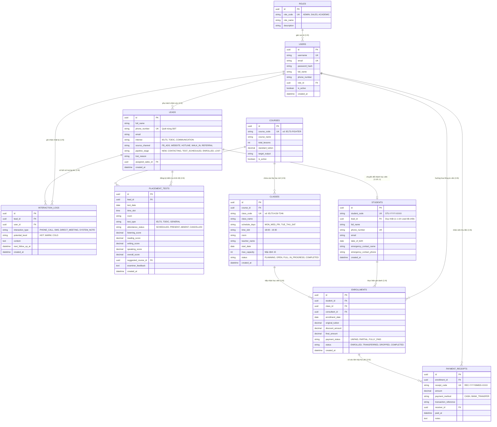

# TÀI LIỆU ĐẶC TẢ TỪ ĐIỂN DỮ LIỆU & SƠ ĐỒ THỰC THỂ KHÁI NIỆM (CONCEPTUAL ERD)
## DỰ ÁN: PHẦN MỀM CRM QUẢN LÝ TUYỂN SINH VÀ ĐÀO TẠO TRUNG TÂM ANH NGỮ (ENGLISH CENTER CRM)

---

| **Mã công việc** | **DB-01** |
| :--- | :--- |
| **Tên tài liệu** | Xây dựng Từ điển dữ liệu (Data Dictionary) và Conceptual ERD |
| **Dự án** | Quản lý dự án phần mềm - Nhóm 8 |
| **Người thực hiện** | **Tam Minh** (`@tamminh6`) - Database Designer / Phân tích hệ thống |
| **Người nghiệm thu** | phong phạm (`@phongphm2`) - Project Leader |
| **Ngày lập** | 29/09/2026 |
| **Phiên bản** | v1.0 (Trạng thái: Hoàn thành - Sẵn sàng nghiệm thu) |
| **Tài liệu tham chiếu**| `BA-01_Khao_sat_nghiep_vu_va_diem_nghen.md`, `SRS-01_Yeu_cau_chuc_nang_va_phi_chuc_nang.md`, `UML-01_Actors_va_So_do_Use_Case_tong_quan.md` |

---

## 1. MỤC TIÊU VÀ PHẠM VI MÔ HÌNH DỮ LIỆU

### 1.1. Mục tiêu
- **Mô hình hóa cấu trúc dữ liệu nền tảng:** Định nghĩa toàn bộ các thực thể thông tin cốt lõi phục vụ quy trình tuyển sinh, tư vấn, thi đánh giá trình độ và quản lý đào tạo cho trung tâm Anh ngữ.
- **Xác định tường minh mối quan hệ (Cardinality & Constraints):** Thiết lập các ràng buộc toàn vẹn thực thể, ràng buộc tham chiếu (Khóa chính PK, Khóa ngoại FK) và các quy tắc nghiệp vụ dữ liệu nhằm loại bỏ dư thừa, ngăn chặn xung đột (như chống tạo trùng Lead, chống Overbooking lớp học).
- **Chuẩn bị đầu vào cho bước tiếp theo (DB-02):** Cung cấp Từ điển dữ liệu chuẩn xác để đội ngũ phát triển dễ dàng sinh mã Physical Schema DDL (PostgreSQL / MySQL) và cấu hình ORM (Prisma / TypeORM).

### 1.2. Danh sách 10 Thực thể cốt lõi trong hệ thống
1. **`roles`**: Danh mục vai trò người dùng trong hệ thống (RBAC).
2. **`users`**: Tài khoản nhân sự trung tâm (Tư vấn viên, Giáo vụ, Quản lý).
3. **`leads`**: Khách hàng tiềm năng cần tư vấn và chăm sóc tuyển sinh.
4. **`interaction_logs`**: Lịch sử các lần gọi điện, nhắn tin, gặp gỡ tư vấn Lead.
5. **`placement_tests`**: Lịch thi, ca thi và kết quả đánh giá năng lực 4 kỹ năng.
6. **`courses`**: Danh mục chương trình đào tạo và khóa học.
7. **`classes`**: Lớp học mở theo đợt khai giảng thực tế.
8. **`students`**: Hồ sơ học viên chính thức sau khi chuyển đổi từ Lead.
9. **`enrollments`**: Hồ sơ đăng ký ghi danh của học viên vào lớp học.
10. **`payment_receipts`**: Biên lai ghi nhận các giao dịch thanh toán học phí thủ công.

---

## 2. SƠ ĐỒ THỰC THỂ KHÁI NIỆM (CONCEPTUAL ERD)

Dưới đây là sơ đồ quan hệ thực thể (ERD) thể hiện cấu trúc thuộc tính và quan hệ tương quan theo chuẩn ký hiệu Crow's Foot:



---

## 3. PHÂN TÍCH QUAN HỆ & BẢNG BẬC LIÊN KẾT (CARDINALITY & BUSINESS RULES)

| Cặp Thực thể | Quan hệ | Mô tả nghiệp vụ & Ràng buộc toàn vẹn | Hành vi Khóa ngoại (FK) |
| :--- | :---: | :--- | :--- |
| **`roles` - `users`** | `1 : N` | Mỗi vai trò gán cho nhiều tài khoản người dùng; mỗi người dùng chỉ có đúng 1 vai trò hệ thống tại một thời điểm (RBAC). | `ON DELETE RESTRICT` (Không được xóa Role nếu đang có User). |
| **`users` - `leads`** | `1 : N` | Một tư vấn viên (Sales) được phân bổ nhiều Lead; một Lead tại một thời điểm chỉ thuộc quyền chăm sóc của tối đa 1 tư vấn viên. | `ON DELETE SET NULL` (Khi nhân viên nghỉ việc, chuyển Lead về trạng thái chưa phân bổ). |
| **`leads` - `interaction_logs`** | `1 : N` | Một Lead có toàn bộ lịch sử chăm sóc qua nhiều lần tương tác (cuộc gọi, ghi chú). | `ON DELETE CASCADE` (Xóa Lead sẽ dọn sạch nhật ký liên quan). |
| **`leads` - `placement_tests`** | `1 : N` | Một Lead có thể đăng ký 1 hoặc nhiều đợt kiểm tra đầu vào (trong trường hợp thi lại hoặc thi nâng hạng). | `ON DELETE CASCADE`. |
| **`courses` - `placement_tests`** | `1 : N` | Dựa vào kết quả thi, hệ thống hoặc giáo vụ có thể liên kết gợi ý một khóa học phù hợp (`suggested_course_id`). | `ON DELETE SET NULL`. |
| **`courses` - `classes`** | `1 : N` | Một khóa học đào tạo sẽ mở ra nhiều lớp học khác nhau theo từng khung giờ và ca học. | `ON DELETE RESTRICT` (Không được xóa khóa học nếu đang có lớp học tham chiếu). |
| **`leads` - `students`** | `0..1 : 1` | Khi Lead được chốt ghi danh thành công, hệ thống tự động sinh hồ sơ Học viên chính thức và lưu `lead_id` để bảo toàn nguồn gốc phễu Marketing. | `ON DELETE SET NULL`. |
| **`students` - `enrollments`** | `1 : N` | Một học viên có thể đăng ký học nhiều lớp khác nhau xuyên suốt lộ trình học. | `ON DELETE RESTRICT` (Không được xóa học viên nếu đang có lịch sử ghi danh). |
| **`classes` - `enrollments`** | `1 : N` | Một lớp học tiếp nhận tối đa số lượt ghi danh bằng đúng chỉ tiêu sĩ số `max_capacity`. | `ON DELETE RESTRICT`. |
| **`enrollments` - `payment_receipts`** | `1 : N` | Một hồ sơ ghi danh có thể được thanh toán qua 1 hoặc nhiều đợt thu (ví dụ: đặt cọc trước, nộp phần còn lại khi khai giảng). | `ON DELETE RESTRICT`. |

---

## 4. TỪ ĐIỂN DỮ LIỆU CHI TIẾT (DATA DICTIONARY)

### 4.1. Bảng `roles` (Danh mục Vai trò Người dùng)
Bảng lưu trữ danh mục quyền hạn cho cơ chế kiểm soát truy cập dựa trên vai trò (RBAC).

| STT | Tên cột (Column Name) | Kiểu dữ liệu | PK/FK | Null? | Unique | Mặc định | Ý nghĩa nghiệp vụ & Ràng buộc giá trị |
| :---: | :--- | :--- | :---: | :---: | :---: | :--- | :--- |
| 1 | `id` | `UUID` | **PK** | No | Yes | `gen_random_uuid()` | Định danh duy nhất vai trò |
| 2 | `role_code` | `VARCHAR(30)` | | No | **Yes** | | Mã vai trò: `'ADMIN'`, `'SALES'`, `'ACADEMIC'` |
| 3 | `role_name` | `VARCHAR(100)` | | No | No | | Tên hiển thị: *Quản lý*, *Tư vấn viên*, *Giáo vụ* |
| 4 | `description` | `VARCHAR(255)` | | Yes | No | | Mô tả chi tiết phạm vi quyền hạn của vai trò |
| 5 | `created_at` | `TIMESTAMPTZ` | | No | No | `CURRENT_TIMESTAMP` | Thời điểm tạo vai trò |

---

### 4.2. Bảng `users` (Tài khoản Nhân sự Trung tâm)
Lưu trữ thông tin cán bộ nhân viên đăng nhập phần mềm.

| STT | Tên cột (Column Name) | Kiểu dữ liệu | PK/FK | Null? | Unique | Mặc định | Ý nghĩa nghiệp vụ & Ràng buộc giá trị |
| :---: | :--- | :--- | :---: | :---: | :---: | :--- | :--- |
| 1 | `id` | `UUID` | **PK** | No | Yes | `gen_random_uuid()` | Định danh duy nhất nhân sự |
| 2 | `username` | `VARCHAR(50)` | | No | **Yes** | | Tên đăng nhập (chỉ gồm chữ cái, số, dấu gạch) |
| 3 | `password_hash` | `VARCHAR(255)` | | No | No | | Mật khẩu đã băm an toàn bằng thuật toán `bcrypt` |
| 4 | `full_name` | `VARCHAR(100)` | | No | No | | Họ và tên đầy đủ của nhân sự |
| 5 | `email` | `VARCHAR(120)` | | No | **Yes** | | Địa chỉ Email công việc |
| 6 | `phone_number` | `VARCHAR(20)` | | Yes | No | | Số điện thoại liên lạc nội bộ |
| 7 | `role_id` | `UUID` | **FK** | No | No | | Tham chiếu `roles(id)` |
| 8 | `is_active` | `BOOLEAN` | | No | No | `TRUE` | Trạng thái tài khoản: `TRUE` (hoạt động), `FALSE` (khóa) |
| 9 | `created_at` | `TIMESTAMPTZ` | | No | No | `CURRENT_TIMESTAMP` | Thời điểm tạo tài khoản |
| 10 | `updated_at` | `TIMESTAMPTZ` | | No | No | `CURRENT_TIMESTAMP` | Thời điểm cập nhật hồ sơ gần nhất |

---

### 4.3. Bảng `leads` (Khách hàng Tiềm năng)
Thực thể trung tâm của phân hệ Quản lý Tuyển sinh (Sales CRM).

| STT | Tên cột (Column Name) | Kiểu dữ liệu | PK/FK | Null? | Unique | Mặc định | Ý nghĩa nghiệp vụ & Ràng buộc giá trị |
| :---: | :--- | :--- | :---: | :---: | :---: | :--- | :--- |
| 1 | `id` | `UUID` | **PK** | No | Yes | `gen_random_uuid()` | Định danh duy nhất Lead |
| 2 | `full_name` | `VARCHAR(100)` | | No | No | | Họ tên khách hàng/học viên tiềm năng |
| 3 | `phone_number` | `VARCHAR(20)` | | No | **Yes** | | Số điện thoại chính (Dùng quét chống tạo trùng) |
| 4 | `email` | `VARCHAR(120)` | | Yes | No | | Email liên hệ |
| 5 | `interest` | `VARCHAR(50)` | | No | No | `'IELTS'` | Khóa học quan tâm: `'IELTS'`, `'TOEIC'`, `'COMMUNICATION'` |
| 6 | `source_channel` | `VARCHAR(50)` | | No | No | `'FB_ADS'` | Kênh tiếp cận: `'FB_ADS'`, `'WEBSITE'`, `'HOTLINE'`, `'WALK_IN'`, `'REFERRAL'` |
| 7 | `pipeline_stage` | `VARCHAR(30)` | | No | No | `'NEW'` | 5 trạng thái vòng đời Kanban: `'NEW'`, `'CONTACTING'`, `'TEST_SCHEDULED'`, `'ENROLLED'`, `'LOST'` |
| 8 | `lost_reason` | `VARCHAR(100)` | | Yes | No | | Lý do hủy (Bắt buộc khi `pipeline_stage = 'LOST'`): *Học phí cao*, *Trùng lịch*, *Khoảng cách xa*... |
| 9 | `assigned_sales_id` | `UUID` | **FK** | Yes | No | | Tham chiếu `users(id)`: Tư vấn viên chịu trách nhiệm |
| 10 | `notes` | `TEXT` | | Yes | No | | Ghi chú nhu cầu ban đầu của khách |
| 11 | `created_at` | `TIMESTAMPTZ` | | No | No | `CURRENT_TIMESTAMP` | Ngày tiếp nhận Lead |
| 12 | `updated_at` | `TIMESTAMPTZ` | | No | No | `CURRENT_TIMESTAMP` | Ngày cập nhật trạng thái gần nhất |

---

### 4.4. Bảng `interaction_logs` (Nhật ký Chăm sóc Khách hàng)
Lưu vết từng lần tương tác giữa tư vấn viên và Lead.

| STT | Tên cột (Column Name) | Kiểu dữ liệu | PK/FK | Null? | Unique | Mặc định | Ý nghĩa nghiệp vụ & Ràng buộc giá trị |
| :---: | :--- | :--- | :---: | :---: | :---: | :--- | :--- |
| 1 | `id` | `UUID` | **PK** | No | Yes | `gen_random_uuid()` | Định danh duy nhất nhật ký |
| 2 | `lead_id` | `UUID` | **FK** | No | No | | Tham chiếu `leads(id)` |
| 3 | `user_id` | `UUID` | **FK** | No | No | | Tham chiếu `users(id)`: Người thực hiện tương tác |
| 4 | `interaction_type` | `VARCHAR(30)` | | No | No | `'PHONE_CALL'` | Hình thức: `'PHONE_CALL'`, `'SMS'`, `'DIRECT_MEETING'`, `'SYSTEM_NOTE'` |
| 5 | `potential_level` | `VARCHAR(20)` | | No | No | `'WARM'` | Đánh giá độ tiềm năng: `'HOT'` (Nóng), `'WARM'` (Ấm), `'COLD'` (Lạnh) |
| 6 | `content` | `TEXT` | | No | No | | Tóm tắt chi tiết nội dung cuộc trao đổi |
| 7 | `next_follow_up_at` | `TIMESTAMPTZ` | | Yes | No | | Thời gian hẹn gọi lại / tái chăm sóc tiếp theo |
| 8 | `created_at` | `TIMESTAMPTZ` | | No | No | `CURRENT_TIMESTAMP` | Thời điểm ghi log |

---

### 4.5. Bảng `placement_tests` (Kiểm tra Đánh giá Trình độ)
Quản lý lịch hẹn, ca thi, và kết quả năng lực đầu vào của học viên.

| STT | Tên cột (Column Name) | Kiểu dữ liệu | PK/FK | Null? | Unique | Mặc định | Ý nghĩa nghiệp vụ & Ràng buộc giá trị |
| :---: | :--- | :--- | :---: | :---: | :---: | :--- | :--- |
| 1 | `id` | `UUID` | **PK** | No | Yes | `gen_random_uuid()` | Định danh bài kiểm tra |
| 2 | `lead_id` | `UUID` | **FK** | No | No | | Tham chiếu `leads(id)` |
| 3 | `test_date` | `DATE` | | No | No | | Ngày hẹn làm bài kiểm tra |
| 4 | `time_slot` | `VARCHAR(20)` | | No | No | | Khung giờ thi (vd: `'09:00 - 10:30'`, `'14:30 - 16:00'`) |
| 5 | `room` | `VARCHAR(50)` | | Yes | No | | Phòng thi (vd: `'Phòng Lab 201'`) |
| 6 | `test_type` | `VARCHAR(30)` | | No | No | `'IELTS'` | Thể loại bài thi: `'IELTS'`, `'TOEIC'`, `'GENERAL'` |
| 7 | `attendance_status` | `VARCHAR(20)` | | No | No | `'SCHEDULED'` | Trạng thái: `'SCHEDULED'`, `'PRESENT'`, `'ABSENT'`, `'CANCELLED'` |
| 8 | `listening_score` | `DECIMAL(3,1)` | | Yes | No | | Điểm Listening (0.0 - 9.0 đối với IELTS) |
| 9 | `reading_score` | `DECIMAL(3,1)` | | Yes | No | | Điểm Reading (0.0 - 9.0) |
| 10 | `writing_score` | `DECIMAL(3,1)` | | Yes | No | | Điểm Writing (0.0 - 9.0) |
| 11 | `speaking_score` | `DECIMAL(3,1)` | | Yes | No | | Điểm Speaking (0.0 - 9.0) |
| 12 | `overall_score` | `DECIMAL(3,1)` | | Yes | No | | Điểm tổng kết Overall Band Score |
| 13 | `suggested_course_id`| `UUID` | **FK** | Yes | No | | Tham chiếu `courses(id)`: Khóa học gợi ý theo điểm |
| 14 | `examiner_feedback` | `TEXT` | | Yes | No | | Nhận xét ưu/nhược điểm và định hướng từ giám khảo |
| 15 | `created_at` | `TIMESTAMPTZ` | | No | No | `CURRENT_TIMESTAMP` | Thời điểm tạo lịch test |

---

### 4.6. Bảng `courses` (Danh mục Khóa học)
Lưu thông tin chương trình đào tạo chuẩn của trung tâm.

| STT | Tên cột (Column Name) | Kiểu dữ liệu | PK/FK | Null? | Unique | Mặc định | Ý nghĩa nghiệp vụ & Ràng buộc giá trị |
| :---: | :--- | :--- | :---: | :---: | :---: | :--- | :--- |
| 1 | `id` | `UUID` | **PK** | No | Yes | `gen_random_uuid()` | Định danh khóa học |
| 2 | `course_code` | `VARCHAR(30)` | | No | **Yes** | | Mã khóa học: `'IELTS-FIGHTER'`, `'TOEIC-500'`,... |
| 3 | `course_name` | `VARCHAR(100)` | | No | No | | Tên khóa học: *IELTS Mục tiêu 6.5+* |
| 4 | `total_lessons` | `INTEGER` | | No | No | `24` | Tổng số buổi học trong toàn khóa (> 0) |
| 5 | `standard_tuition` | `DECIMAL(12,2)` | | No | No | | Học phí niêm yết chuẩn (VND, >= 0) |
| 6 | `target_output` | `VARCHAR(100)` | | Yes | No | | Chuẩn đầu ra cam kết (vd: `IELTS 6.5`, `B2 CEFR`) |
| 7 | `description` | `TEXT` | | Yes | No | | Mô tả giáo trình, tài liệu và lộ trình |
| 8 | `is_active` | `BOOLEAN` | | No | No | `TRUE` | `TRUE` (Đang tuyển sinh), `FALSE` (Dừng mở lớp) |
| 9 | `created_at` | `TIMESTAMPTZ` | | No | No | `CURRENT_TIMESTAMP` | Ngày tạo khóa học |

---

### 4.7. Bảng `classes` (Lớp học Mở mới)
Quản lý các lớp học thực tế chuẩn bị khai giảng hoặc đang diễn ra.

| STT | Tên cột (Column Name) | Kiểu dữ liệu | PK/FK | Null? | Unique | Mặc định | Ý nghĩa nghiệp vụ & Ràng buộc giá trị |
| :---: | :--- | :--- | :---: | :---: | :---: | :--- | :--- |
| 1 | `id` | `UUID` | **PK** | No | Yes | `gen_random_uuid()` | Định danh lớp học |
| 2 | `course_id` | `UUID` | **FK** | No | No | | Tham chiếu `courses(id)`: Thuộc khóa học nào |
| 3 | `class_code` | `VARCHAR(50)` | | No | **Yes** | | Mã lớp: `'IELTS-K26-T246'` |
| 4 | `class_name` | `VARCHAR(100)` | | No | No | | Tên hiển thị lớp học |
| 5 | `schedule_days` | `VARCHAR(30)` | | No | No | `'MON_WED_FRI'` | Lịch học trong tuần: `'MON_WED_FRI'`, `'TUE_THU_SAT'`, `'WEEKEND'` |
| 6 | `time_slot` | `VARCHAR(30)` | | No | No | `'18:00 - 19:30'` | Ca học trong ngày |
| 7 | `room` | `VARCHAR(50)` | | Yes | No | | Phòng học chỉ định (vd: `'Phòng 302'`) |
| 8 | `teacher_name` | `VARCHAR(100)` | | Yes | No | | Tên giảng viên phụ trách |
| 9 | `start_date` | `DATE` | | No | No | | Ngày khai giảng dự kiến |
| 10 | `max_capacity` | `INTEGER` | | No | No | `15` | Sĩ số tối đa của lớp (mặc định 15 học viên) |
| 11 | `status` | `VARCHAR(20)` | | No | No | `'PLANNING'` | Trạng thái: `'PLANNING'`, `'OPEN'`, `'FULL'`, `'IN_PROGRESS'`, `'COMPLETED'` |
| 12 | `created_at` | `TIMESTAMPTZ` | | No | No | `CURRENT_TIMESTAMP` | Thời điểm khởi tạo lớp |

---

### 4.8. Bảng `students` (Hồ sơ Học viên Chính thức)
Lưu thông tin học viên chính thức của trung tâm sau khi chốt hợp đồng.

| STT | Tên cột (Column Name) | Kiểu dữ liệu | PK/FK | Null? | Unique | Mặc định | Ý nghĩa nghiệp vụ & Ràng buộc giá trị |
| :---: | :--- | :--- | :---: | :---: | :---: | :--- | :--- |
| 1 | `id` | `UUID` | **PK** | No | Yes | `gen_random_uuid()` | Định danh học viên |
| 2 | `student_code` | `VARCHAR(30)` | | No | **Yes** | | Mã định danh học viên: `'STU-2026-0001'` |
| 3 | `lead_id` | `UUID` | **FK** | Yes | **Yes** | | Tham chiếu `leads(id)` (Duy nhất 1-1, truy vết nguồn) |
| 4 | `full_name` | `VARCHAR(100)` | | No | No | | Họ và tên học viên |
| 5 | `phone_number` | `VARCHAR(20)` | | No | **Yes** | | Số điện thoại cá nhân |
| 6 | `email` | `VARCHAR(120)` | | Yes | No | | Email liên hệ học tập |
| 7 | `date_of_birth` | `DATE` | | Yes | No | | Ngày tháng năm sinh |
| 8 | `address` | `VARCHAR(255)` | | Yes | No | | Địa chỉ cư trú |
| 9 | `emergency_contact_name`| `VARCHAR(100)` | | Yes | No | | Họ tên phụ huynh / người liên hệ khẩn cấp |
| 10 | `emergency_contact_phone`| `VARCHAR(20)` | | Yes | No | | Số điện thoại người liên hệ khẩn cấp |
| 11 | `created_at` | `TIMESTAMPTZ` | | No | No | `CURRENT_TIMESTAMP` | Thời điểm nhập học |

---

### 4.9. Bảng `enrollments` (Hồ sơ Đăng ký Ghi danh Xếp lớp)
Bảng trung gian liên kết Học viên và Lớp học cụ thể, kiêm theo dõi nghĩa vụ học phí.

| STT | Tên cột (Column Name) | Kiểu dữ liệu | PK/FK | Null? | Unique | Mặc định | Ý nghĩa nghiệp vụ & Ràng buộc giá trị |
| :---: | :--- | :--- | :---: | :---: | :---: | :--- | :--- |
| 1 | `id` | `UUID` | **PK** | No | Yes | `gen_random_uuid()` | Định danh lượt ghi danh |
| 2 | `student_id` | `UUID` | **FK** | No | No | | Tham chiếu `students(id)` |
| 3 | `class_id` | `UUID` | **FK** | No | No | | Tham chiếu `classes(id)` |
| 4 | `consultant_id` | `UUID` | **FK** | Yes | No | | Tham chiếu `users(id)`: Sales được tính doanh số/KPI |
| 5 | `enrollment_date` | `DATE` | | No | No | `CURRENT_DATE` | Ngày làm thủ tục xếp lớp |
| 6 | `original_tuition`| `DECIMAL(12,2)` | | No | No | | Học phí gốc của khóa học tại thời điểm đăng ký |
| 7 | `discount_amount` | `DECIMAL(12,2)` | | No | No | `0.00` | Số tiền được giảm giá / học bổng (>= 0) |
| 8 | `final_amount` | `DECIMAL(12,2)` | | No | No | | Số tiền thực phải đóng = `original_tuition - discount_amount` |
| 9 | `payment_status` | `VARCHAR(20)` | | No | No | `'UNPAID'` | Tình trạng nộp: `'UNPAID'`, `'PARTIAL'`, `'FULLY_PAID'` |
| 10 | `status` | `VARCHAR(20)` | | No | No | `'ENROLLED'` | Tình trạng học: `'ENROLLED'`, `'TRANSFERRED'`, `'DROPPED'`, `'COMPLETED'` |
| 11 | `notes` | `TEXT` | | Yes | No | | Ghi chú thỏa thuận riêng |
| 12 | `created_at` | `TIMESTAMPTZ` | | No | No | `CURRENT_TIMESTAMP` | Thời điểm ghi danh |

> **Ràng buộc Unique:** Thiết lập cặp `UNIQUE(student_id, class_id)` để đảm bảo một học viên không bị đăng ký trùng 2 lần vào cùng 1 lớp học.

---

### 4.10. Bảng `payment_receipts` (Biên lai Thu Học phí)
Quản lý các giao dịch thu tiền mặt hoặc chuyển khoản thủ công.

| STT | Tên cột (Column Name) | Kiểu dữ liệu | PK/FK | Null? | Unique | Mặc định | Ý nghĩa nghiệp vụ & Ràng buộc giá trị |
| :---: | :--- | :--- | :---: | :---: | :---: | :--- | :--- |
| 1 | `id` | `UUID` | **PK** | No | Yes | `gen_random_uuid()` | Định danh biên lai |
| 2 | `enrollment_id` | `UUID` | **FK** | No | No | | Tham chiếu `enrollments(id)`: Nộp tiền cho lượt ghi danh nào |
| 3 | `receipt_code` | `VARCHAR(50)` | | No | **Yes** | | Mã phiếu thu: `'REC-20260929-001'` |
| 4 | `amount` | `DECIMAL(12,2)` | | No | No | | Số tiền nộp trong đợt này (> 0) |
| 5 | `payment_method` | `VARCHAR(30)` | | No | No | `'BANK_TRANSFER'` | Phương thức thanh toán: `'CASH'`, `'BANK_TRANSFER'` |
| 6 | `transaction_reference` | `VARCHAR(100)` | | Yes | No | | Mã ủy nhiệm chi / Mã giao dịch ngân hàng đối soát |
| 7 | `receiver_id` | `UUID` | **FK** | No | No | | Tham chiếu `users(id)`: Nhân sự thu ngân / Sales lập phiếu |
| 8 | `paid_at` | `TIMESTAMPTZ` | | No | No | `CURRENT_TIMESTAMP` | Ngày giờ thực thu tiền |
| 9 | `notes` | `TEXT` | | Yes | No | | Ghi chú kèm theo phiếu thu |

---

## 5. CHIẾN LƯỢC ĐÁNH CHỈ MỤC (INDEXING STRATEGY) VÀ TOÀN VẸN DỮ LIỆU

### 5.1. Tối ưu hiệu năng truy vấn (Performance Indexes)
Để đáp ứng yêu cầu phản hồi API $\le 1.0$ giây (`NFR-PERF-01`) theo tài liệu SRS-01:
1. **Index tìm kiếm & quét trùng Lead:**
   - `CREATE UNIQUE INDEX idx_leads_phone ON leads(phone_number);`
   - `CREATE INDEX idx_leads_stage ON leads(pipeline_stage);`
   - `CREATE INDEX idx_leads_assigned ON leads(assigned_sales_id);`
2. **Index tra cứu lịch thi & sĩ số:**
   - `CREATE INDEX idx_placement_tests_date ON placement_tests(test_date, time_slot);`
   - `CREATE INDEX idx_classes_status ON classes(status);`
3. **Index báo cáo thống kê doanh thu:**
   - `CREATE INDEX idx_payment_receipts_date ON payment_receipts(paid_at);`
   - `CREATE INDEX idx_enrollments_student_class ON enrollments(student_id, class_id);`

### 5.2. Giải pháp kỹ thuật chống Overbooking (Ngăn vượt sĩ số tối đa)
* **Thách thức:** Khi 2 tư vấn viên cùng lúc bấm "Xếp lớp" cho 2 học viên vào lớp chỉ còn đúng 1 chỗ trống cuối cùng.
* **Giải pháp trong Thiết kế CSDL (ACID Transaction & Row-level Locking):**
  1. Sử dụng giao dịch cơ sở dữ liệu `SERIALIZABLE` hoặc cơ chế khóa dòng:
     ```sql
     -- Khóa dòng dữ liệu của lớp để đối soát sĩ số an toàn
     SELECT id, max_capacity FROM classes WHERE id = :classId FOR UPDATE;
     
     -- Đếm sĩ số thực tế hiện tại
     SELECT COUNT(*) FROM enrollments WHERE class_id = :classId AND status = 'ENROLLED';
     
     -- Nếu số lượng < max_capacity: Cho phép INSERT INTO enrollments
     -- Nếu số lượng == max_capacity: Hủy giao dịch (ROLLBACK) và báo lỗi "Lớp đã đầy"
     ```
  2. Tự động cập nhật `classes.status = 'FULL'` khi sĩ số thực đạt `max_capacity`.

