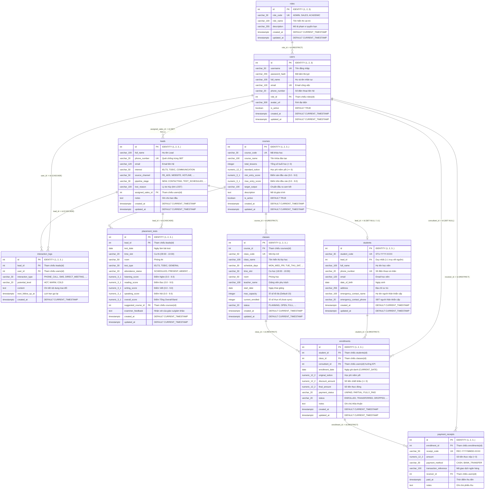

# TÀI LIỆU ĐẶC TẢ THIẾT KẾ CƠ SỞ DỮ LIỆU VẬT LÝ & SCRIPT TẠO BẢNG (PHYSICAL DATABASE SPECIFICATION)
## DỰ ÁN: PHẦN MỀM CRM QUẢN LÝ TUYỂN SINH VÀ ĐÀO TẠO TRUNG TÂM ANH NGỮ (ENGLISH CENTER CRM)

---

| **Mã công việc** | **DB-02** |
| :--- | :--- |
| **Tên tài liệu** | Chuyển Conceptual ERD thành Physical DB, viết script tạo bảng & khóa |
| **Dự án** | Quản lý dự án phần mềm - Nhóm 8 |
| **Người thực hiện** | **Tam Minh** (`@tamminh6`) - Database Engineer / Phân tích hệ thống |
| **Người nghiệm thu** | phong phạm (`@phongphm2`) - Project Leader |
| **Ngày lập** | 30/09/2026 |
| **Phiên bản** | v2.0 (Trạng thái: Hoàn thành - Chuẩn hóa Khóa chính Số nguyên INT siêu gọn) |
| **Tài liệu tham chiếu** | `DB-01_Tu_dien_du_lieu_va_Conceptual_ERD.md`, `SRS-01_Yeu_cau_chuc_nang_va_phi_chuc_nang.md`, `UML-02_Dac_ta_kich_ban_Use_Case_chi_tiet_cho_3_luong_chinh.md` |
| **Mã nguồn đính kèm** | `database/schema.sql` (DDL Schema), `database/seed_data.sql` (Dữ liệu mẫu) |

---

## 1. MỤC TIÊU VÀ QUYẾT ĐỊNH THIẾT KẾ CƠ SỞ DỮ LIỆU VẬT LÝ

### 1.1. Mục tiêu
- **Hiện thực hóa 100% mô hình khái niệm:** Chuyển đổi toàn diện 10 thực thể nghiệp vụ đã được định nghĩa trong tài liệu `[DB-01]` thành các bảng CSDL quan hệ vật lý tối ưu trên PostgreSQL.
- **Chuẩn hóa dữ liệu đạt cấp 3NF (Third Normal Form):** Loại bỏ triệt để các phụ thuộc bắc cầu và dư thừa thông tin, bảo đảm tính toàn vẹn tham chiếu.
- **Tối ưu hóa hiệu năng & bảo vệ nghiệp vụ:**
  - Thiết lập cơ chế khóa bi quan (Row-level Locking) và Transaction ACID chống **Overbooking sĩ số** lớp học theo kịch bản `[UML-02]`.
  - Tích hợp Trigger tự động tính toán sĩ số và cập nhật dấu thời gian `updated_at`.
  - Xây dựng hệ thống Index chuyên sâu giúp thời gian phản hồi API tra cứu $\le 1.0$ giây (`NFR-PERF-01`).

### 1.2. Quyết định Kỹ thuật: Khóa chính Số nguyên (`INT GENERATED BY DEFAULT AS IDENTITY`)
Tại bước thiết kế vật lý, hệ thống thống nhất sử dụng **Số nguyên tự tăng (`INT IDENTITY`)** làm kiểu dữ liệu khóa chính (`PK`) và khóa ngoại (`FK`) thay vì UUID chuỗi 36 ký tự:
1. **Siêu ngắn gọn & Trực quan:** Các ID trong hệ thống là các số nguyên đơn giản `1, 2, 3...`, giúp lập trình viên Backend (`Long Phạm`) và Frontend (`phong phạm`) dễ dàng gọi API RESTful (ví dụ: `GET /api/leads/1`, `POST /api/enrollments` với `class_id: 1`).
2. **Tiết kiệm 75% dung lượng lưu trữ:** Kiểu `INT` chỉ tốn 4 bytes/khóa (so với `UUID` tốn 16 bytes/khóa), giúp giảm đáng kể kích thước bảng dữ liệu và bộ đệm RAM.
3. **Tăng tốc độ truy vấn:** Các phép `JOIN` và tìm kiếm trên chỉ mục B-Tree bằng số nguyên có tốc độ xử lý nhanh hơn từ 2 - 3 lần so với chuỗi UUID.
4. **Hỗ trợ Seed Data mượt mà:** Cho phép nạp dữ liệu mẫu chỉ định ID cụ thể (`1, 2, 3...`) đồng thời tự động đồng bộ Sequence (`setval`) để các lượt ghi mới tự động tăng tiếp (`4, 5, 6...`).

---

## 2. SƠ ĐỒ THỰC THỂ QUAN HỆ VẬT LÝ (PHYSICAL ERD)

---

## 3. BẢNG ÁNH XẠ KIỂU DỮ LIỆU & RÀNG BUỘC 10 BẢNG VẬT LÝ

| STT | Bảng CSDL | Khóa chính (`PK`) | Khóa ngoại (`FK`) | Ràng buộc duy nhất (`UNIQUE`) |
| :---: | :--- | :--- | :--- | :--- |
| 1 | **`roles`** | `id INT` | Không có | `role_code` |
| 2 | **`users`** | `id INT` | `role_id -> roles(id)` | `username`, `email` |
| 3 | **`leads`** | `id INT` | `assigned_sales_id -> users(id)` | `phone_number` |
| 4 | **`interaction_logs`** | `id INT` | `lead_id -> leads(id)` `user_id -> users(id)` | Không có |
| 5 | **`courses`** | `id INT` | Không có | `course_code` |
| 6 | **`placement_tests`** | `id INT` | `lead_id -> leads(id)` `suggested_course_id -> courses(id)` | Không có |
| 7 | **`classes`** | `id INT` | `course_id -> courses(id)` | `class_code` |
| 8 | **`students`** | `id INT` | `lead_id -> leads(id)` | `student_code`, `phone_number`, `lead_id` (1-1) |
| 9 | **`enrollments`** | `id INT` | `student_id -> students(id)` `class_id -> classes(id)` `consultant_id -> users(id)` | `UNIQUE(student_id, class_id)` |
| 10 | **`payment_receipts`** | `id INT` | `enrollment_id -> enrollments(id)` `receiver_id -> users(id)` | `receipt_code` |

---

## 4. DỮ LIỆU MẪU MẶC ĐỊNH (SEED DATA SUMMARY)

Tập tin `database/seed_data.sql` đã được thiết lập với toàn bộ ID số nguyên ngắn gọn trực quan:
- **`roles`:** `1` (ADMIN), `2` (SALES), `3` (ACADEMIC).
- **`users`:** `1` (Tam Minh), `2` (Long Phạm), `3` (phong phạm).
- **`courses`:** `1` (IELTS Foundation), `2` (IELTS Fighter), `3` (IELTS Master), `4` (TOEIC 550+), `5` (Giao tiếp).
- **`classes`:** `1` (K26 T2-4-6), `2` (K27 T3-5-7), `3` (F20).
- **`leads`:** `1` đến `10` (phủ trọn 5 cột Kanban).
- **`students`:** `1, 2, 3` (mã STU-2026-0001, 0002, 0003).
- **`enrollments`:** `1, 2, 3`.
- **`payment_receipts`:** `1, 2, 3`.
- Cuối file có sẵn lệnh `setval` đồng bộ sequence tự tăng, sẵn sàng cho các lần `INSERT` tiếp theo trên API.
