# KẾ HOẠCH QUẢN LÝ TIẾN ĐỘ, PHÂN RÃ CÔNG VIỆC (WBS) & TIẾN ĐỘ ĐƯỜNG GĂNG (CPM)
## HỆ THỐNG CRM QUẢN LÝ TUYỂN SINH VÀ ĐÀO TẠO TRUNG TÂM ANH NGỮ (EDUFLOW CRM)

---

### THÔNG TIN TỔNG QUAN TÀI LIỆU (DOCUMENT METADATA)

| Thuộc tính | Chi tiết định danh |
| :--- | :--- |
| **Mã tài liệu** | **PM-01** |
| **Tên tài liệu** | Kế hoạch Quản lý Tiến độ, Cấu trúc Phân rã Công việc (WBS) & Phân tích Đường găng (CPM) |
| **Tên dự án** | Hệ thống CRM Quản lý Tuyển sinh và Đào tạo Trung tâm Anh ngữ (EduFlow CRM) |
| **Học phần** | Quản lý Dự án Phần mềm (Software Project Management) |
| **Đơn vị đào tạo** | Học viện Công nghệ Bưu chính Viễn thông (PTIT) - Khoa Công nghệ Thông tin |
| **Nhóm thực hiện** | Nhóm 8 |
| **Project Sponsor** | Giảng viên hướng dẫn học phần & Ban đánh giá chuyên môn |
| **Project Manager (Leader)** | **phong phạm** (`@phongphm2` / `phongg2905`) |
| **Đội ngũ nòng cốt** | **Long Phạm** (`@longphm11`) - System Analyst & QA Lead<br>**Minh Tâm** (`@tamminh6`) - Technical Architect & Frontend Lead |
| **Tiêu chuẩn đối sánh** | **PMBOK® Guide – 7th Edition (Planning Performance Domain)** & Scrum Guide 2020 |
| **Phiên bản tài liệu** | **v1.0 (Ban hành chính thức)** |
| **Thời gian chu kỳ dự án** | 8 tuần (40 ngày làm việc tiêu chuẩn: 28/09/2026 - 20/11/2026) |

---

## 1. PHƯƠNG PHÁP QUẢN LÝ TIẾN ĐỘ (SCHEDULE MANAGEMENT APPROACH)

### 1.1. Mô hình Tiếp cận Phát triển Lai (Hybrid Development Approach)
Dự án áp dụng mô hình phát triển **Hybrid (Lai)** theo khuyến nghị của PMBOK 7th Edition:
* **Khung Quản trị Cấp cao (Predictive / Governance Layer):** Thiết lập các Cột mốc Nghiệm thu cố định (Milestone Gates M1 $\rightarrow$ M4), đường cơ sở tiến độ (Schedule Baseline) và quản trị rủi ro trên đường găng (Critical Path).
* **Khung Thực thi Tác vụ (Adaptive / Agile Layer):** Chia nhỏ chu kỳ dự án thành **4 Sprint (mỗi Sprint 2 tuần = 10 ngày làm việc)**. Đội ngũ áp dụng bảng Kanban trực quan trên Trello, họp giao ban nhanh (Daily Standup 15 phút), lập kế hoạch Sprint (Sprint Planning) và họp cải tiến quy trình (Sprint Retrospective) ở cuối mỗi Sprint.

```
┌────────────────────────────────────────────────────────────────────────────────────────┐
│                        VÒNG ĐỜI DỰ ÁN LAI (HYBRID PROJECT LIFECYCLE)                   │
├────────────────────┬────────────────────┬────────────────────┬─────────────────────────┤
│ SPRINT 1 (Tuần 1-2)│ SPRINT 2 (Tuần 3-4)│ SPRINT 3 (Tuần 5-6)│ SPRINT 4 (Tuần 7-8)     │
│ Khảo sát, Nghiệp vụ│ Thiết kế CSDL, UI  │ Phát triển 3 Luồng │ Kiểm thử Tích hợp,      │
│ & Đặc tả Yêu cầu   │ & Dựng Khung Base  │ Nghiệp vụ Cốt lõi  │ Đóng gói & Bảo vệ Đồ án │
├────────────────────┼────────────────────┼────────────────────┼─────────────────────────┤
│ M1: DUYỆT ĐẶC TẢ   │ M2: DUYỆT KIẾN TRÚC│ M3: NGHIỆM THU MVP │ M4: BẢO VỆ CHÍNH THỨC   │
└────────────────────┴────────────────────┴────────────────────┴─────────────────────────┘
```

### 1.2. Đơn vị Quy ước và Quy tắc Lập Lịch
* **Thời gian làm việc tiêu chuẩn:** 1 tuần làm việc = 5 ngày (Thứ 2 đến Thứ 6), không tính ngày nghỉ lễ và cuối tuần.
* **Thời lượng dự án:** 8 tuần $\times$ 5 ngày/tuần = **40 ngày làm việc (Working Days)**.
* **Cơ chế kiểm soát tiến độ:** Cập nhật trạng thái công việc hàng ngày qua mã định danh tác vụ, đo lường tỷ lệ hoàn thành theo tiến trình đường găng CPM.

---

## 2. BẢNG ÁNH XẠ CẤU TRÚC PHÂN CẤP WBS & MÃ ĐỊNH DANH TÁC VỤ (WBS MAPPING TABLE)

Nhằm đảm bảo tính liên kết xuyên suốt giữa tiêu chuẩn học thuật PMBOK và hệ thống tác vụ thực tế trên Trello và thư mục tài liệu `docs/`, toàn bộ các công việc được ánh xạ chuẩn xác:

| Mã WBS Cấp 3 (PMI) | Mã Tác vụ / Tài liệu | Tên Gói công việc / Sản phẩm bàn giao | Phụ trách chính (RACI) | Sprint | Thời lượng |
| :---: | :---: | :--- | :---: | :---: | :---: |
| **1.1.1** | `[CHARTER-01]` | Bản Hiến chương Dự án Phần mềm (Project Charter) | phong phạm (**A/R**) | Sprint 1 | 2 ngày |
| **1.1.2** | `[PM-01]` | Kế hoạch Quản lý Tiến độ, Phân rã WBS & Đường găng CPM | phong phạm (**A/R**) | Sprint 1 | Song song |
| **1.1.3** | `[PM-02]` | Ước lượng Nỗ lực (FPA, PERT) & Dự toán Ngân sách | Long Phạm (**R**) / phong phạm (**A**) | Sprint 1 | Song song |
| **1.1.4** | `[PM-03]` | Kế hoạch Quản lý Rủi ro & Bảng nhật ký Risk Register | Long Phạm (**R**) / phong phạm (**A**) | Sprint 2 | Song song |
| **1.1.5** | `[PM-04]` | Đo lường Hiệu suất Dự án (EVM & Agile Metrics) | phong phạm (**A/R**) | Sprint 3-4 | Xuyên suốt |
| **1.1.6** | `[PM-05]` | Kế hoạch Đảm bảo Chất lượng (QA/QC) & Kiểm soát Đổi | Minh Tâm (**R**) / phong phạm (**A**) | Sprint 2 | Song song |
| **1.2.1** | `[BA-01]` | Khảo sát quy trình nghiệp vụ & Xác định điểm nghẽn | Long Phạm (**R**) / phong phạm (**A**) | Sprint 1 | 2 ngày |
| **1.2.2** | `[BA-02]` | Sơ đồ quy trình nghiệp vụ tổng quan BPMN 2.0 | Long Phạm (**R**) / phong phạm (**A**) | Sprint 1 | 2 ngày |
| **1.2.3** | `[SRS-01]` | Đặc tả yêu cầu phần mềm chi tiết (SRS) | Long Phạm (**R**) / phong phạm (**A**) | Sprint 1 | 2 ngày |
| **1.2.4** | `[UML-01]` | Xác định Actors & Sơ đồ Use Case tổng quan | Long Phạm (**R**) / phong phạm (**A**) | Sprint 1 | 2 ngày |
| **1.2.5** | `[UML-02]` | Đặc tả kịch bản Use Case chi tiết cho 3 luồng chính | Long Phạm (**R**) / phong phạm (**A**) | Sprint 1 | 2 ngày |
| **1.3.1** | `[DES-01]` | Thiết kế UI/UX Design System & Interactive Prototype | Minh Tâm (**R**) / phong phạm (**A**) | Sprint 2 | 4 ngày |
| **1.3.2** | `[DB-01]` | Từ điển dữ liệu & Mô hình Khái niệm Conceptual ERD | Minh Tâm (**R**) / phong phạm (**A**) | Sprint 2 | 3 ngày |
| **1.3.3** | `[DB-02]` | Lược đồ CSDL Vật lý & Script tạo bảng PostgreSQL | phong phạm (**A/R**) / Minh Tâm (**R**)| Sprint 2 | 3 ngày |
| **1.3.4** | `[BE-01]` | Khung Server Base REST API, DB Pool & Xác thực JWT | phong phạm (**A/R**) | Sprint 2 | 4 ngày |
| **1.3.5** | `[FE-01]` | Khung Frontend AppShell, Routing & Design System Mantine| Minh Tâm (**R**) / phong phạm (**A**) | Sprint 2 | 5 ngày |
| **1.4.1** | `[BE/FE-02]`| Phân hệ Tuyển sinh & Quản lý Lead Kanban Pipeline (UC-01)| Cả nhóm (phong phạm chủ trì) | Sprint 3 | 3 ngày |
| **1.4.2** | `[BE/FE-03]`| Phân hệ Đặt lịch & Chấm điểm Placement Test (UC-02) | Cả nhóm (phong phạm chủ trì) | Sprint 3 | 4 ngày |
| **1.4.3** | `[BE/FE-04]`| Phân hệ Quản lý Lớp học & Xếp lớp tự động (UC-03) | Cả nhóm (phong phạm chủ trì) | Sprint 3 | 3 ngày |
| **1.5.1** | `[TEST-01]`| Kịch bản kiểm thử tích hợp, Kiểm tra toàn vẹn & Vá lỗi | Long Phạm (**R**) / Cả nhóm sửa lỗi | Sprint 4 | 5 ngày |
| **1.5.2** | `[FINAL-01]`| Tổng hợp Hồ sơ Báo cáo, Đóng gói Mã nguồn & Video Demo | Cả nhóm (phong phạm duyệt) | Sprint 4 | 5 ngày |

---

## 3. CẤU TRÚC PHÂN RÃ CÔNG VIỆC WBS 4 CẤP ĐỘ (HIERARCHICAL WBS TREE)

```
1.0 DỰ ÁN EDUFLOW CRM
│
├── 1.1 Khởi tạo & Quản trị Dự án (Project Management)
│   ├── 1.1.1 Lập Bản Hiến chương Dự án [CHARTER-01]
│   ├── 1.1.2 Kế hoạch Quản lý Tiến độ, WBS & CPM [PM-01]
│   ├── 1.1.3 Kế hoạch Ước lượng Nỗ lực & Ngân sách [PM-02]
│   ├── 1.1.4 Kế hoạch Quản lý Rủi ro & Risk Register [PM-03]
│   ├── 1.1.5 Kế hoạch Đo lường EVM & Agile Metrics [PM-04]
│   └── 1.1.6 Kế hoạch QA/QC & Kiểm soát Thay đổi [PM-05]
│
├── 1.2 Sprint 1: Phân tích & Đặc tả Yêu cầu Hệ thống (Tuần 1 - 2)
│   ├── 1.2.1 Khảo sát nghiệp vụ thực tế & Xác định điểm nghẽn [BA-01]
│   ├── 1.2.2 Mô hình hóa quy trình nghiệp vụ BPMN 2.0 [BA-02]
│   ├── 1.2.3 Đặc tả yêu cầu phần mềm chức năng & phi chức năng [SRS-01]
│   ├── 1.2.4 Mô hình hóa Actors & Sơ đồ Use Case tổng quan [UML-01]
│   └── 1.2.5 Đặc tả kịch bản Use Case chi tiết 3 luồng chính [UML-02]
│
├── 1.3 Sprint 2: Thiết kế Kiến trúc & Xây dựng Khung Nền tảng (Tuần 3 - 4)
│   ├── 1.3.1 Thiết kế UI/UX Wireframe, Design System & Prototype [DES-01]
│   ├── 1.3.2 Thiết kế Từ điển Dữ liệu & Conceptual ERD [DB-01]
│   ├── 1.3.3 Thiết kế Physical Schema & Script DDL PostgreSQL [DB-02]
│   ├── 1.3.4 Xây dựng Khung Backend API, DB Pool & Middleware Auth [BE-01]
│   └── 1.3.5 Xây dựng Khung Frontend AppShell, Navigation & Layout [FE-01]
│
├── 1.4 Sprint 3: Phát triển Full-stack 3 Luồng Nghiệp vụ Cốt lõi (Tuần 5 - 6)
│   ├── 1.4.1 Xây dựng Phân hệ Quản lý Lead Pipeline Kanban [BE/FE-02]
│   │   ├── 1.4.1.1 API CRUD Lead & Chuyển trạng thái giao dịch
│   │   └── 1.4.1.2 Giao diện kéo thả Kanban 5 cột tương tác
│   ├── 1.4.2 Xây dựng Phân hệ Đặt lịch & Chấm điểm Placement Test [BE/FE-03]
│   │   ├── 1.4.2.1 Backend Engine kiểm tra xung đột phòng/giáo viên
│   │   └── 1.4.2.2 Form đặt lịch & Bảng nhập điểm 4 kỹ năng
│   └── 1.4.3 Xây dựng Phân hệ Quản lý Lớp & Xếp lớp tự động [BE/FE-04]
│       ├── 1.4.3.1 Thuật toán ràng buộc sĩ số tối đa & trạng thái đóng lớp
│       └── 1.4.3.2 Giao diện Wizard chọn lớp & In biên lai nhập học
│
└── 1.5 Sprint 4: Kiểm thử Tích hợp, Nghiệm thu & Bảo vệ Đồ án (Tuần 7 - 8)
    ├── 1.5.1 Kiểm thử tích hợp hệ thống, Kiểm tra bảo mật & Fix bug [TEST-01]
    └── 1.5.2 Hoàn thiện Báo cáo Đồ án, Slide Thuyết minh & Video Demo [FINAL-01]
```

---

## 4. TỪ ĐIỂN WBS (WBS DICTIONARY)

Từ điển WBS cung cấp đặc tả chi tiết về phạm vi, đầu vào, hoạt động, sản phẩm bàn giao và tiêu chí nghiệm thu cho từng gói công việc chính:

### Gói công việc: WBS 1.1.1 - Bản Hiến chương Dự án `[CHARTER-01]`
* **Mục tiêu:** Xác lập cơ sở pháp lý và sự phê chuẩn chính thức cho dự án EduFlow CRM.
* **Đầu vào (Inputs):** Mục tiêu học phần QLDA, đề tài đồ án nhóm 8, các yêu cầu của hội đồng giảng viên.
* **Hoạt động chính:** Xác định mục tiêu S.M.A.R.T, Business Case, phạm vi In/Out-scope, phân tích Stakeholder, phân quyền RACI.
* **Sản phẩm bàn giao (Deliverable):** File `CHARTER-01_Ban_Hien_chuong_du_an_Project_Charter.md` v2.0.
* **Tiêu chí nghiệm thu (DoD):** Đầy đủ 9 phần chuẩn PMBOK 7; Leader ký duyệt; Giảng viên bảo trợ thông qua.

### Gói công việc: WBS 1.2.1 đến 1.2.5 - Gói Yêu cầu Nghiệp vụ `[BA & UML]`
* **Mục tiêu:** Chuyển hóa bài toán thực tế của trung tâm Anh ngữ thành tài liệu phân tích kỹ thuật chuẩn xác.
* **Đầu vào (Inputs):** Khảo sát thực tế các trung tâm quy mô 500-2000 học viên.
* **Hoạt động chính:** Xác định điểm nghẽn; vẽ BPMN 3 phân làn; viết SRS 40 yêu cầu; lập sơ đồ Use Case và đặc tả kịch bản 3 luồng chính.
* **Sản phẩm bàn giao (Deliverables):** `BA-01`, `BA-02`, `SRS-01`, `UML-01`, `UML-02`.
* **Tiêu chí nghiệm thu (DoD):** Kịch bản Use Case bao quát cả luồng chính (Main Flow) và luồng ngoại lệ (Alternative/Exception Flows).

### Gói công việc: WBS 1.3.1 đến 1.3.5 - Gói Thiết kế & Nền tảng `[DES, DB, BASE]`
* **Mục tiêu:** Xây dựng nền tảng kiến trúc phần mềm, cơ sở dữ liệu và giao diện mẫu đồng bộ.
* **Đầu vào (Inputs):** `SRS-01`, `UML-02`.
* **Hoạt động chính:** Thiết kế Figma Clickable Prototype; chuẩn hóa 3NF CSDL quan hệ; viết DDL PostgreSQL; dựng Backend Express Typescript; dựng Frontend Vite React.
* **Sản phẩm bàn giao (Deliverables):** `DES-01`, `DB-01`, `DB-02`, mã nguồn Base Server & Frontend AppShell.
* **Tiêu chí nghiệm thu (DoD):** Chạy `npm run dev` ở cả 2 bên không phát sinh lỗi; DB seed data thành công; phân quyền JWT hoạt động chuẩn.

### Gói công việc: WBS 1.4.1 đến 1.4.3 - Gói Phát triển Nghiệp vụ Lõi `[BE/FE]`
* **Mục tiêu:** Lập trình hoàn chỉnh 3 Use Case cốt lõi đảm bảo tính toàn vẹn dữ liệu.
* **Đầu vào (Inputs):** Tài liệu phân tích, DB Schema, Figma UI.
* **Hoạt động chính:** Xây dựng API và giao diện Kanban Lead; thuật toán kiểm tra xung đột ca thi Placement Test; quy trình xếp lớp tự động khóa sĩ số.
* **Sản phẩm bàn giao (Deliverables):** Mã nguồn các module tương ứng tại `backend/src/` và `frontend/src/pages/`.
* **Tiêu chí nghiệm thu (DoD):** Dữ liệu cập nhật thời gian thực vào PostgreSQL; không xảy ra hiện tượng overbooking hoặc race condition.

### Gói công việc: WBS 1.5.1 & 1.5.2 - Gói Kiểm thử & Đóng gói `[TEST & FINAL]`
* **Mục tiêu:** Đảm bảo chất lượng hệ thống, đóng gói mã nguồn và chuẩn bị bảo vệ trước hội đồng.
* **Đầu vào (Inputs):** Hệ thống tích hợp hoàn chỉnh tại Sprint 3.
* **Hoạt động chính:** Thực thi 50+ Test Cases; đo lường độ trễ API; sửa lỗi; viết báo cáo tổng kết đồ án; quay video demo kịch bản; soạn slide.
* **Sản phẩm bàn giao (Deliverables):** Tài liệu `TEST-01`, Báo cáo Đồ án bản in, Slide trình chiếu và Video minh họa.
* **Tiêu chí nghiệm thu (DoD):** 100% test cases cốt lõi pass; không có lỗi blocker/critical; sẵn sàng bảo vệ.

---

## 5. SƠ ĐỒ MẠNG DỰ ÁN (PROJECT NETWORK DIAGRAM - PDM)

Sơ đồ mạng thể hiện mối quan hệ phụ thuộc tiền nhiệm (Precedence Relationships) giữa các tác vụ theo chuẩn **Phương pháp Sơ đồ Tiền nhiệm (PDM - Finish-to-Start [FS])**:

```mermaid
graph LR
    %% Sprint 1
    T101["1.1.1: CHARTER-01<br>Dur: 2d"] --> T102["1.2.1: BA-01<br>Dur: 2d"]
    T102 --> T103["1.2.2: BA-02<br>Dur: 2d"]
    T102 --> T104["1.2.3: SRS-01<br>Dur: 2d"]
    T103 --> T105["1.2.4: UML-01<br>Dur: 2d"]
    T104 --> T105
    T105 --> T106["1.2.5: UML-02<br>Dur: 2d"]

    %% Milestone M1
    T106 --> M1{{"CỘT MỐC M1<br>(Ngày 10)"}}

    %% Sprint 2
    M1 --> T201["1.3.1: DES-01 (UI/UX)<br>Dur: 4d"]
    M1 --> T202["1.3.2: DB-01 (ERD)<br>Dur: 3d"]
    T202 --> T203["1.3.3: DB-02 (DDL)<br>Dur: 3d"]
    T203 --> T204["1.3.4: BE-01 (Base API)<br>Dur: 4d"]
    T201 --> T205["1.3.5: FE-01 (AppShell)<br>Dur: 5d"]

    %% Milestone M2
    T204 --> M2{{"CỘT MỐC M2<br>(Ngày 20)"}}
    T205 --> M2

    %% Sprint 3
    M2 --> T301["1.4.1: BE/FE-02 (Kanban)<br>Dur: 3d"]
    T301 --> T302["1.4.2: BE/FE-03 (Test)<br>Dur: 4d"]
    T302 --> T303["1.4.3: BE/FE-04 (Class)<br>Dur: 3d"]

    %% Milestone M3
    T303 --> M3{{"CỘT MỐC M3<br>(Ngày 30)"}}

    %% Sprint 4
    M3 --> T401["1.5.1: TEST-01 (QA/QC)<br>Dur: 5d"]
    T401 --> T402["1.5.2: FINAL-01 (Defense)<br>Dur: 5d"]
    T402 --> M4{{"CỘT MỐC M4<br>BẢO VỆ ĐỒ ÁN (Ngày 40)"}}

    %% Styling
    classDef critical fill:#ff4d4f,stroke:#a8071a,stroke-width:2px,color:#fff;
    classDef noncritical fill:#40a9ff,stroke:#096dd9,stroke-width:2px,color:#fff;
    classDef milestone fill:#faad14,stroke:#d48806,stroke-width:2px,color:#000;

    class T101,T102,T103,T104,T105,T106,T202,T203,T204,T301,T302,T303,T401,T402 critical;
    class T201,T205 noncritical;
    class M1,M2,M3,M4 milestone;
```



---

## 6. PHÂN TÍCH ĐƯỜNG GĂNG (CRITICAL PATH METHOD - CPM)

### 6.1. Bảng Thông số Tiến độ Chi tiết (Forward & Backward Pass Calculations)
Quy ước tính toán:
* **ES (Early Start):** Thời điểm bắt đầu sớm nhất có thể.
* **EF (Early Finish):** Thời điểm hoàn thành sớm nhất ($EF = ES + \text{Duration}$).
* **LS (Late Start):** Thời điểm bắt đầu muộn nhất không làm trễ dự án ($LS = LF - \text{Duration}$).
* **LF (Late Finish):** Thời điểm hoàn thành muộn nhất không làm trễ dự án.
* **Total Float ($TF$):** Thời gian dự trữ toàn phần ($TF = LS - ES = LF - EF$).
* **Free Float ($FF$):** Thời gian dự trữ tự do ($FF = \min(ES_{\text{successors}}) - EF$).

| Mã WBS | Tác vụ | Tiền nhiệm (Predecessors) | Thời lượng ($D$) | ES (Ngày) | EF (Ngày) | LS (Ngày) | LF (Ngày) | Total Float ($TF$) | Free Float ($FF$) | Trạng thái Đường găng |
| :---: | :---: | :---: | :---: | :---: | :---: | :---: | :---: | :---: | :---: | :---: |
| **1.1.1** | `CHARTER-01` | Không | 2 ngày | 0 | 2 | 0 | 2 | **0 ngày** | 0 ngày | **CRITICAL (Đường găng)** |
| **1.2.1** | `BA-01` | 1.1.1 | 2 ngày | 2 | 4 | 2 | 4 | **0 ngày** | 0 ngày | **CRITICAL (Đường găng)** |
| **1.2.2** | `BA-02` | 1.2.1 | 2 ngày | 4 | 6 | 4 | 6 | **0 ngày** | 0 ngày | **CRITICAL (Đường găng)** |
| **1.2.3** | `SRS-01` | 1.2.1 | 2 ngày | 4 | 6 | 4 | 6 | **0 ngày** | 0 ngày | **CRITICAL (Đường găng)** |
| **1.2.4** | `UML-01` | 1.2.2, 1.2.3 | 2 ngày | 6 | 8 | 6 | 8 | **0 ngày** | 0 ngày | **CRITICAL (Đường găng)** |
| **1.2.5** | `UML-02` | 1.2.4 | 2 ngày | 8 | 10 | 8 | 10 | **0 ngày** | 0 ngày | **CRITICAL (Đường găng)** |
| **1.3.1** | `DES-01` | 1.2.5 | 4 ngày | 10 | 14 | 11 | 15 | **1 ngày** | 0 ngày | Không găng (Có Float) |
| **1.3.2** | `DB-01` | 1.2.5 | 3 ngày | 10 | 13 | 10 | 13 | **0 ngày** | 0 ngày | **CRITICAL (Đường găng)** |
| **1.3.3** | `DB-02` | 1.3.2 | 3 ngày | 13 | 16 | 13 | 16 | **0 ngày** | 0 ngày | **CRITICAL (Đường găng)** |
| **1.3.4** | `BE-01` | 1.3.3 | 4 ngày | 16 | 20 | 16 | 20 | **0 ngày** | 0 ngày | **CRITICAL (Đường găng)** |
| **1.3.5** | `FE-01` | 1.3.1 | 5 ngày | 14 | 19 | 15 | 20 | **1 ngày** | 1 ngày | Không găng (Có Float) |
| **1.4.1** | `BE/FE-02` | 1.3.4, 1.3.5 | 3 ngày | 20 | 23 | 20 | 23 | **0 ngày** | 0 ngày | **CRITICAL (Đường găng)** |
| **1.4.2** | `BE/FE-03` | 1.4.1 | 4 ngày | 23 | 27 | 23 | 27 | **0 ngày** | 0 ngày | **CRITICAL (Đường găng)** |
| **1.4.3** | `BE/FE-04` | 1.4.2 | 3 ngày | 27 | 30 | 27 | 30 | **0 ngày** | 0 ngày | **CRITICAL (Đường găng)** |
| **1.5.1** | `TEST-01` | 1.4.3 | 5 ngày | 30 | 35 | 30 | 35 | **0 ngày** | 0 ngày | **CRITICAL (Đường găng)** |
| **1.5.2** | `FINAL-01` | 1.5.1 | 5 ngày | 35 | 40 | 35 | 40 | **0 ngày** | 0 ngày | **CRITICAL (Đường găng)** |

### 6.2. Kết luận về Đường găng & Tổng thời lượng
* **Chuỗi Đường găng (Critical Path):**
  $$\text{CHARTER-01} \rightarrow \text{BA-01} \rightarrow \text{BA-02 / SRS-01} \rightarrow \text{UML-01} \rightarrow \text{UML-02} \rightarrow \text{DB-01} \rightarrow \text{DB-02} \rightarrow \text{BE-01} \rightarrow \text{BE/FE-02} \rightarrow \text{BE/FE-03} \rightarrow \text{BE/FE-04} \rightarrow \text{TEST-01} \rightarrow \text{FINAL-01}$$
* **Tổng thời lượng dự án ngắn nhất để hoàn thành:** Đúng **40 ngày làm việc (8 tuần làm việc tiêu chuẩn)**.
* **Nhận xét chuyên môn:**
  * Bất kỳ sự chậm trễ nào dù chỉ 0.5 ngày trên các tác vụ thuộc đường găng sẽ **lập tức làm lùi ngày bảo vệ đồ án của nhóm**.
  * Nhánh thiết kế UI/UX (`DES-01`) và dựng Khung Frontend (`FE-01`) có thời gian dự trữ $TF = 1$ ngày, tạo khoảng đệm an toàn nhỏ cho Frontend Lead nếu cần tinh chỉnh bảng màu và component library.

---

## 7. BIỂU ĐỒ GANTT TIẾN ĐỘ THỰC HIỆN 8 TUẦN (GANTT CHART)

```mermaid
gantt
    title BIỂU ĐỒ GANTT TIẾN ĐỘ THỰC HIỆN DỰ ÁN EDUFLOW CRM (8 TUẦN)
    dateFormat  YYYY-MM-DD
    axisFormat  Tuần %W

    section Sprint 1: Phân tích & Đặc tả
    [CHARTER-01] Bản Hiến chương Dự án       :crit, done, s1_1, 2026-09-28, 2d
    [BA-01] Khảo sát nghiệp vụ & Điểm nghẽn  :crit, done, s1_2, after s1_1, 2d
    [BA-02] Quy trình BPMN 2.0               :crit, done, s1_3, after s1_2, 2d
    [SRS-01] Đặc tả yêu cầu phần mềm chi tiết :crit, done, s1_4, after s1_2, 2d
    [UML-01] Sơ đồ Use Case tổng quan        :crit, done, s1_5, after s1_4, 2d
    [UML-02] Kịch bản chi tiết 3 Use Case    :crit, done, s1_6, after s1_5, 2d
    Nghiệm thu M1: Duyệt Đặc tả Yêu cầu      :milestone, m1, after s1_6, 0d

    section Sprint 2: Thiết kế & Base
    [DES-01] Thiết kế UI/UX & Prototype      :done, s2_1, after m1, 4d
    [DB-01] Từ điển dữ liệu & Conceptual ERD :crit, done, s2_2, after m1, 3d
    [DB-02] Physical DB Schema & DDL Script  :crit, active, s2_3, after s2_2, 3d
    [BE-01] Khung Backend API & Auth JWT     :crit, active, s2_4, after s2_3, 4d
    [FE-01] Khung Frontend AppShell & Mantine:active, s2_5, after s2_1, 5d
    Nghiệm thu M2: Duyệt CSDL & Khung Base   :milestone, m2, after s2_4, 0d

    section Sprint 3: 3 Luồng Nghiệp vụ
    [BE/FE-02] Phân hệ Lead Kanban (UC-01)   :crit, s3_1, after m2, 3d
    [BE/FE-03] Placement Test & Chấm (UC-02) :crit, s3_2, after s3_1, 4d
    [BE/FE-04] Xếp lớp tự động (UC-03)       :crit, s3_3, after s3_2, 3d
    Nghiệm thu M3: Hoàn thành Core Engine    :milestone, m3, after s3_3, 0d

    section Sprint 4: Kiểm thử & Bảo vệ
    [TEST-01] Kiểm thử tích hợp & Vá lỗi     :crit, s4_1, after m3, 5d
    [FINAL-01] Báo cáo Đồ án, Slide & Demo   :crit, s4_2, after s4_1, 5d
    Nghiệm thu M4: BẢO VỆ CHÍNH THỨC         :milestone, m4, after s4_2, 0d
```

---

## 8. CHIẾN LƯỢC NÉN TIẾN ĐỘ & ỨNG PHÓ CHẬM TRỄ (SCHEDULE COMPRESSION TECHNIQUES)

Khi chỉ số hiệu suất tiến độ $SPI = EV / PV < 0.9$ hoặc phát sinh nguy cơ chậm mốc nghiệm thu, Project Manager áp dụng 2 kỹ thuật chuẩn PMBOK:

```
┌───────────────────────────────────────┬───────────────────────────────────────┐
│     FAST TRACKING (LÀM SONG SONG)     │         CRASHING (TĂNG CƯỜNG LỰC)     │
├───────────────────────────────────────┼───────────────────────────────────────┤
│ Cho phép các tác vụ tiến hành đồng    │ Huy động thêm giờ làm việc tập trung  │
│ thời thay vì đợi nối tiếp.            │ (Overtime) của 3 thành viên vào cuối  │
│ Ví dụ: Frontend Lead bắt đầu code     │ tuần hoặc tái phân bổ task từ thành   │
│ giao diện ngay khi có bản nháp DDL    │ viên có Float sang hỗ trợ tác vụ      │
│ thay vì đợi Backend hoàn tất 100%.    │ trên đường găng.                      │
├───────────────────────────────────────┼───────────────────────────────────────┤
│ Ưu điểm: Không phát sinh chi phí tiền.│ Ưu điểm: Giảm nhanh thời gian găng.   │
│ Nhược điểm: Tăng rủi ro phải làm lại. │ Nhược điểm: Dễ gây mệt mỏi nhân sự.   │
└───────────────────────────────────────┴───────────────────────────────────────┘
```

---

## 9. QUY CHUẨN KIỂM SOÁT VÀ BÁO CÁO TIẾN ĐỘ (SCHEDULE MONITORING & CONTROLLING)

1. **Giao ban hàng ngày (Daily Standup):**
   * Thời lượng: 15 phút vào 21:00 mỗi tối qua Discord/Google Meet.
   * 3 câu hỏi cốt lõi: *Hôm nay đã làm gì? Ngày mai làm gì? Có gặp vật cản (Blocker) nào trên đường găng không?*
2. **Kiểm soát Sai lệch Tiến độ (Tolerance Thresholds):**
   * **Mức Xanh ($SPI \ge 0.95$):** Tiến độ an toàn, tiếp tục duy trì.
   * **Mức Vàng ($0.85 \le SPI < 0.95$):** Chậm nhẹ, kích hoạt kỹ thuật Fast Tracking giữa FE và BE.
   * **Mức Đỏ ($SPI < 0.85$ hoặc trễ mốc Milestone > 2 ngày):** Họp khẩn cấp, cắt giảm các tính năng thứ yếu (ví dụ: chuyển export file Excel sang diện mở rộng sau).
3. **Quy định Nghiệm thu Cột mốc (Milestone Sign-off):**
   * Mọi cột mốc M1 $\rightarrow$ M4 chỉ được coi là hoàn tất khi có sự ký duyệt của Project Leader **phong phạm** sau khi kiểm thử thực tế trên nhánh local.
