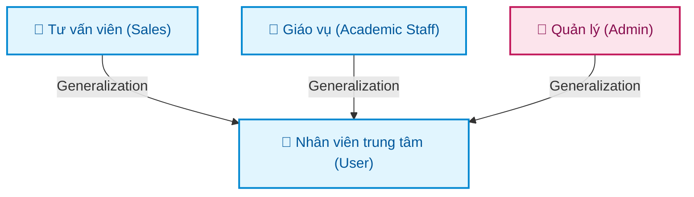
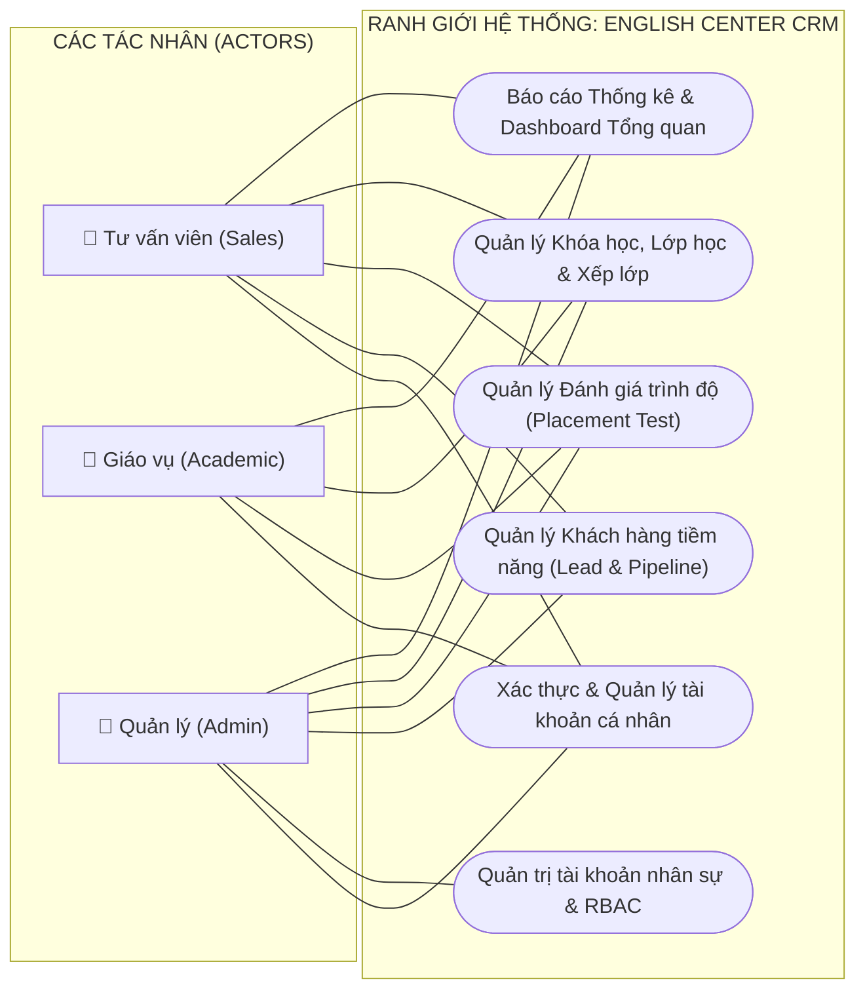
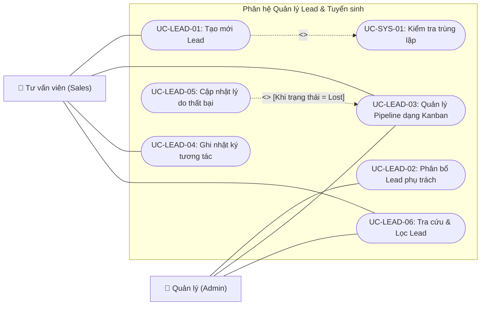
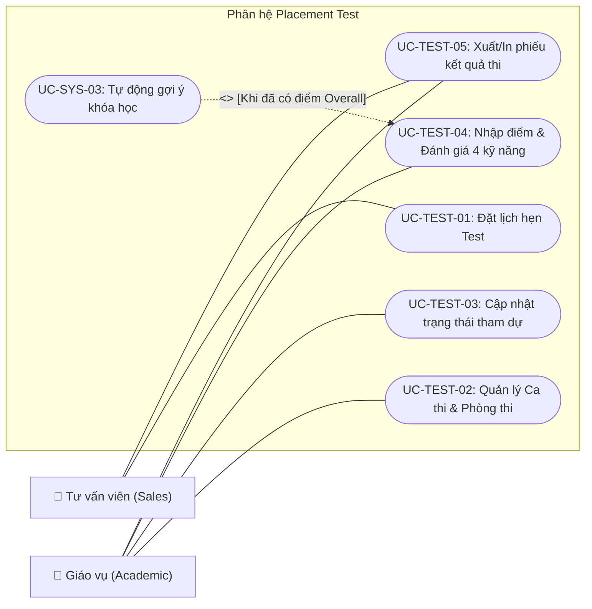
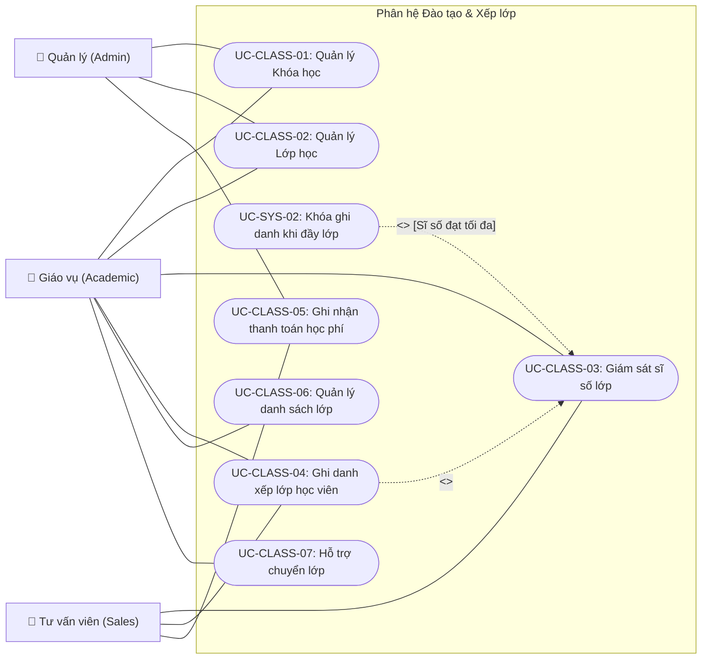
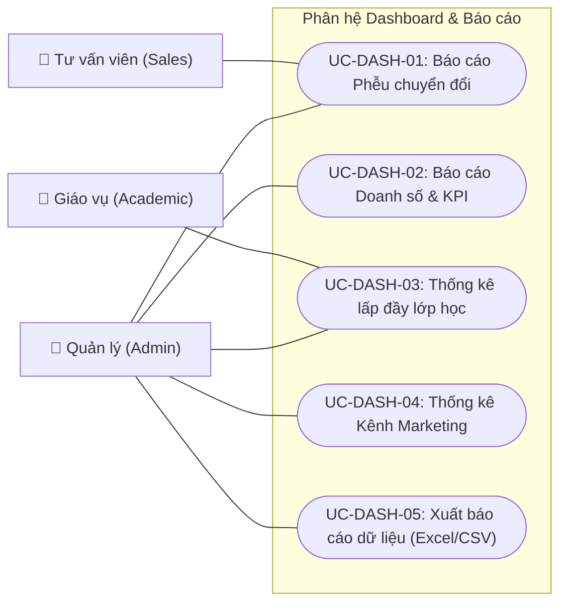

# TÀI LIỆU ĐẶC TẢ ACTORS & SƠ ĐỒ USE CASE TỔNG QUAN HỆ THỐNG (CHUẨN UML 2.0)
## DỰ ÁN: PHẦN MỀM CRM QUẢN LÝ TUYỂN SINH VÀ ĐÀO TẠO TRUNG TÂM ANH NGỮ (ENGLISH CENTER CRM)

---

| **Mã công việc** | **UML-01** |
| :--- | :--- |
| **Tên tài liệu** | Xác định Actors và vẽ Sơ đồ Use Case tổng quan hệ thống CRM |
| **Dự án** | Quản lý dự án phần mềm - Nhóm 8 |
| **Người thực hiện** | **Tam Minh** (`@tamminh6`) - System Analyst / Phân tích hệ thống |
| **Người nghiệm thu** | phong phạm (`@phongphm2`) - Project Leader |
| **Ngày lập** | 29/09/2026 |
| **Tài liệu căn cứ** | `BA-01_Khao_sat_nghiep_vu_va_diem_nghen.md`, `SRS-01_Yeu_cau_chuc_nang_va_phi_chuc_nang.md` |

---

## 1. MỤC TIÊU VÀ QUY TẮC MÔ HÌNH HÓA USE CASE

Tài liệu này được xây dựng tuân thủ nghiêm ngặt các quy ước thiết kế chuẩn UML:
1. **Ranh giới hệ thống (System Boundary):** Khung chữ nhật bao trọn toàn bộ Use Cases thuộc phạm vi phần mềm CRM.
2. **Tác nhân (Actors):** Nằm hoàn toàn bên ngoài ranh giới hệ thống.
3. **Đường liên kết (Association):** Đường thẳng nét liền không mũi tên (`---`) nối Actor với Use Case mà họ tương tác.
4. **Quan hệ Bao hàm (`<<include>>`):** Đường nét đứt có mũi tên từ **Base Use Case $\rightarrow$ Included Use Case** (thể hiện hành vi bắt buộc phải thực thi).
5. **Quan hệ Mở rộng (`<<extend>>`):** Đường nét đứt có mũi tên từ **Extension Use Case $\rightarrow$ Base Use Case** (thể hiện hành vi bổ sung chỉ xảy ra khi thỏa mãn điều kiện/điểm mở rộng - Extension Point).
6. **Quan hệ Kế thừa (Generalization):** Đường nét liền có mũi tên tam giác rỗng từ Actor con trỏ về Actor cha.

---

## 2. ĐỊNH NGHĨA CHI TIẾT CÁC TÁC NHÂN (ACTORS DEFINITIONS)

Hệ thống có **3 Tác nhân chính (Primary Actors - Con người)** cùng kế thừa từ một Actor khái niệm chung là `Nhân viên trung tâm (User)`:

### 2.1. Tác nhân 1: Tư vấn viên Tuyển sinh (Sales / Admissions Officer - `ACT-SALES`)
* **Mục tiêu:** Tiếp nhận data, gọi điện tư vấn, nuôi dưỡng Lead qua Pipeline Kanban, đặt lịch hẹn kiểm tra trình độ và chốt ghi danh học viên.
* **Quyền hạn dữ liệu:** Chỉ xem chi tiết số điện thoại của các Lead được phân bổ cho mình; được ghi nhật ký cuộc gọi và ghi nhận thanh toán học phí thủ công.

### 2.2. Tác nhân 2: Nhân viên Giáo vụ (Academic Staff / Education Coordinator - `ACT-ACAD`)
* **Mục tiêu:** Tổ chức phòng thi và lịch thi Placement Test; tiếp đón thí sinh, nhập điểm chi tiết và nhận xét năng lực; quản lý danh mục khóa học, mở lớp học mới, phân bổ giáo viên và phòng học; điều phối xếp lớp và chuyển lớp.
* **Quyền hạn dữ liệu:** Toàn quyền quản trị danh mục đào tạo (Khóa học, Lớp học, Lịch thi, Danh sách học viên chính thức).

### 2.3. Tác nhân 3: Quản lý trung tâm (Center Director / Admin - `ACT-ADMIN`)
* **Mục tiêu:** Điều hành toàn bộ trung tâm, phân bổ data Lead cho đội ngũ Sales, quản lý tài khoản nhân viên và phân quyền RBAC; theo dõi báo cáo phễu chuyển đổi, doanh thu, KPI và hiệu quả kênh Marketing.
* **Quyền hạn dữ liệu:** Toàn quyền (Super Admin) trên toàn bộ hệ thống.

---

## 3. SƠ ĐỒ USE CASE MỨC TỔNG QUAN (HIGH-LEVEL USE CASE DIAGRAM)

Sơ đồ tổng quan thể hiện mối quan hệ giữa 3 Actors với 5 gói nghiệp vụ (Packages) cốt lõi của hệ thống:

---

## 4. SƠ ĐỒ USE CASE CHI TIẾT TỪNG PHÂN HỆ NGHIỆP VỤ

### 4.1. Phân hệ 1: Quản lý Lead & Phễu Tuyển sinh (Lead Management)

> **Lưu ý chuẩn UML:**
> - `UC-SYS-01 (Kiểm tra trùng lặp)` là hành vi bắt buộc khi tạo Lead $\rightarrow$ **`UC-LEAD-01` trỏ mũi tên nét đứt `<<include>>` sang `UC-SYS-01`**.
> - `UC-LEAD-05 (Cập nhật lý do thất bại)` là hành vi mở rộng bổ sung chỉ xảy ra khi Lead bị kéo sang cột *Hủy (Lost)* $\rightarrow$ **`UC-LEAD-05` trỏ mũi tên nét đứt `<<extend>>` VỀ `UC-LEAD-03`**.

---

### 4.2. Phân hệ 2: Đánh giá trình độ (Placement Test Management)

> **Lưu ý chuẩn UML:**
> - `UC-SYS-03 (Gợi ý khóa học)` là chức năng mở rộng tự động hiển thị sau khi đã nhập điểm Overall $\rightarrow$ **`UC-SYS-03` trỏ mũi tên nét đứt `<<extend>>` VỀ `UC-TEST-04`**.

---

### 4.3. Phân hệ 3: Khóa học, Lớp học & Xếp lớp Ghi danh (Course, Class & Enrollment)

> **Lưu ý chuẩn UML:**
> - Khi thực hiện xếp lớp (`UC-CLASS-04`), hệ thống bắt buộc phải kiểm tra sĩ số khả dụng $\rightarrow$ **`UC-CLASS-04` `<<include>>` `UC-CLASS-03`**.
> - Khóa lớp khi đủ sĩ số (`UC-SYS-02`) là trường hợp đặc biệt mở rộng từ quá trình giám sát sĩ số $\rightarrow$ **`UC-SYS-02` `<<extend>>` VỀ `UC-CLASS-03`**.

---

### 4.4. Phân hệ 4: Báo cáo Thống kê & Dashboard Tổng quan (Analytics & Dashboard)

---

## 5. MA TRẬN 27 USE CASES PHÂN QUYỀN RBAC

| Gói phân hệ | Mã Use Case | Tên Use Case | Sales | Academic | Admin | Mối quan hệ UML |
| :--- | :--- | :--- | :---: | :---: | :---: | :--- |
| **1. Auth & RBAC** | `UC-AUTH-01` | Đăng nhập hệ thống | ✔️ | ✔️ | ✔️ | Association |
| | `UC-AUTH-02` | Đăng xuất hệ thống | ✔️ | ✔️ | ✔️ | Association |
| | `UC-AUTH-03` | Đổi mật khẩu cá nhân | ✔️ | ✔️ | ✔️ | Association |
| | `UC-AUTH-04` | Quản lý tài khoản nhân sự | - | - | ✔️ | Association |
| **2. Lead & Tuyển sinh**| `UC-LEAD-01` | Tạo mới Lead thủ công | ✔️ | - | ✔️ | `<<include>>` UC-SYS-01 |
| | `UC-LEAD-02` | Phân bổ Lead phụ trách | - | - | ✔️ | Association |
| | `UC-LEAD-03` | Quản lý Pipeline Kanban | ✔️ | - | ✔️ | Base of `<<extend>>` UC-LEAD-05 |
| | `UC-LEAD-04` | Ghi nhật ký tương tác | ✔️ | - | ✔️ | Association |
| | `UC-LEAD-05` | Cập nhật lý do thất bại | ✔️ | - | ✔️ | `<<extend>>` VỀ UC-LEAD-03 |
| | `UC-LEAD-06` | Tra cứu & Bộ lọc Lead | ✔️ | - | ✔️ | Association |
| **3. Placement Test** | `UC-TEST-01` | Đặt lịch hẹn Test | ✔️ | - | ✔️ | Association |
| | `UC-TEST-02` | Quản lý Ca thi & Phòng thi | - | ✔️ | ✔️ | Association |
| | `UC-TEST-03` | Điểm danh & Trạng thái thi | - | ✔️ | ✔️ | Association |
| | `UC-TEST-04` | Nhập điểm & Đánh giá | - | ✔️ | ✔️ | Base of `<<extend>>` UC-SYS-03 |
| | `UC-TEST-05` | Xuất/In phiếu kết quả thi | ✔️ | ✔️ | ✔️ | Association |
| **4. Khóa học & Lớp** | `UC-CLASS-01` | Quản lý danh mục Khóa học | - | ✔️ | ✔️ | Association |
| | `UC-CLASS-02` | Quản lý Lớp học mở mới | - | ✔️ | ✔️ | Association |
| | `UC-CLASS-03` | Giám sát sĩ số thời gian thực| ✔️ | ✔️ | ✔️ | Included by UC-CLASS-04 |
| | `UC-CLASS-04` | Ghi danh xếp lớp học viên | ✔️ | ✔️ | ✔️ | `<<include>>` UC-CLASS-03 |
| | `UC-CLASS-05` | Ghi nhận thanh toán học phí | ✔️ | - | ✔️ | Association |
| | `UC-CLASS-06` | Quản lý danh sách học viên lớp| - | ✔️ | ✔️ | Association |
| | `UC-CLASS-07` | Xử lý chuyển lớp học viên | - | ✔️ | ✔️ | Association |
| **5. Analytics & Dashboard**| `UC-DASH-01` | Báo cáo Phễu chuyển đổi | ✔️ | - | ✔️ | Association |
| | `UC-DASH-02` | Báo cáo Doanh số & KPI | - | - | ✔️ | Association |
| | `UC-DASH-03` | Thống kê lấp đầy lớp | - | ✔️ | ✔️ | Association |
| | `UC-DASH-04` | Thống kê Kênh Marketing | - | - | ✔️ | Association |
| | `UC-DASH-05` | Xuất báo cáo Excel/CSV | - | - | ✔️ | Association |

---

