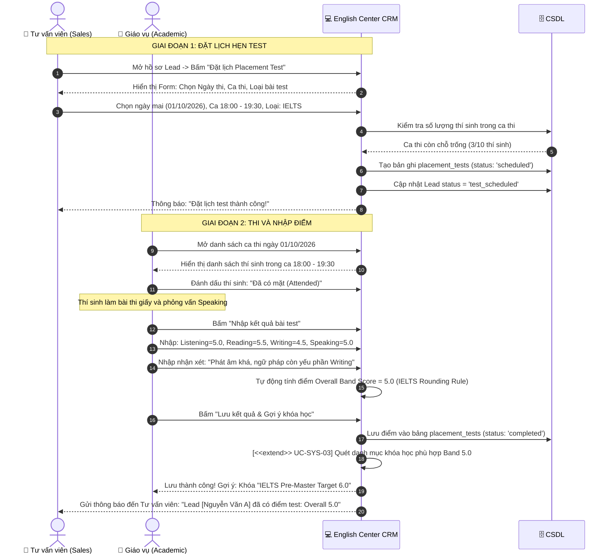
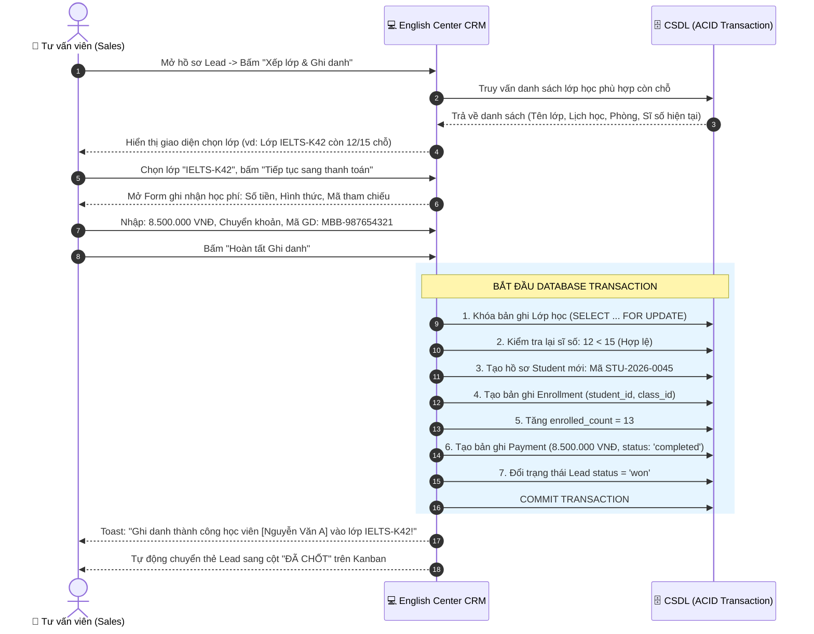

# TÀI LIỆU ĐẶC TẢ KỊCH BẢN USE CASE CHI TIẾT CHO 3 LUỒNG NGHIỆP VỤ CHÍNH (USE CASE SPECIFICATIONS)
## DỰ ÁN: PHẦN MỀM CRM QUẢN LÝ TUYỂN SINH VÀ ĐÀO TẠO TRUNG TÂM ANH NGỮ (ENGLISH CENTER CRM)

---

| **Mã công việc** | **UML-02** |
| :--- | :--- |
| **Tên tài liệu** | Đặc tả kịch bản Use Case chi tiết cho 3 luồng chính |
| **Dự án** | Quản lý dự án phần mềm - Nhóm 8 |
| **Người thực hiện** | **Tam Minh** (`@tamminh6`) - System Analyst / Business Analyst |
| **Người nghiệm thu** | **phong phạm** (`@phongphm2`) - Project Leader |
| **Ngày lập** | 30/09/2026 |
| **Phiên bản** | **v1.0 (Final Deliverable Ready)** |
| **Tài liệu căn cứ** | `BA-01_Khao_sat_nghiep_vu_va_diem_nghen.md`, `BA-02_So_do_quy_trinh_nghiep_vu_tong_quan_BPMN.md`, `SRS-01_Yeu_cau_chuc_nang_va_phi_chuc_nang.md`, `UML-01_Actors_va_So_do_Use_Case_tong_quan.md`, `DB-01_Tu_dien_du_lieu_va_Conceptual_ERD.md` |

---

## 1. MỤC TIÊU VÀ QUY CHUẨN ĐẶC TẢ KỊCH BẢN USE CASE

### 1.1. Mục tiêu tài liệu
Tài liệu này cung cấp **Đặc tả kịch bản Use Case chi tiết (Use Case Specification / Fully Dressed Form)** cho 3 luồng nghiệp vụ xương sống của hệ thống English Center CRM:
1. **Luồng 1 (UC-SPEC-01):** Quản lý Lead theo Pipeline Kanban & Ghi nhận Tương tác.
2. **Luồng 2 (UC-SPEC-02):** Đặt lịch hẹn & Nhập điểm bài Placement Test.
3. **Luồng 3 (UC-SPEC-03):** Xếp lớp, Thu học phí & Ghi danh Học viên chính thức.

Tài liệu này là căn cứ tối thượng (Single Source of Truth) để:
- Đội ngũ **UI/UX Designer** thiết kế Wireframe và Prototype Figma chính xác từng trạng thái form và nút bấm (`[DES-01]`).
- Đội ngũ **Backend Developer** thiết kế API contracts, Data Validation và State Machine (`[BE-01]`).
- Đội ngũ **Tester / QA** viết kịch bản kiểm thử (Test Cases, Acceptance Criteria).

### 1.2. Cấu trúc kịch bản chuẩn (IEEE / Cockburn Template)
Mỗi Use Case được đặc tả chi tiết gồm 11 mục:
* **Mã & Tên Use Case:** Định danh duy nhất và tên hành động.
* **Mức độ ưu tiên:** Theo chuẩn MoSCoW (Must / Should / Could).
* **Tác nhân chính (Primary Actor) & Tác nhân hỗ trợ (Secondary Actors).**
* **Mô tả tóm tắt (Brief Description).**
* **Tiền điều kiện (Pre-conditions).**
* **Hậu điều kiện thành công (Post-conditions - Success Guarantees) & Thất bại (Minimal Guarantees).**
* **Luồng sự kiện cơ bản (Main Success Scenario / Happy Path):** Tương tác 2 cột (Hành động của Actor $\leftrightarrow$ Phản hồi của Hệ thống CRM).
* **Các luồng rẽ nhánh (Alternative Flows).**
* **Các luồng ngoại lệ (Exception Flows).**
* **Quy tắc nghiệp vụ áp dụng (Business Rules).**
* **Giao diện & Điểm mở rộng (UI Notes & Extension Points).**

---

## 2. KỊCH BẢN CHI TIẾT LUỒNG 1: QUẢN LÝ LEAD THEO PIPELINE & GHI NHẬN TƯƠNG TÁC

### 2.1. Thông tin chung
* **Mã Use Case:** `UC-SPEC-01`
* **Use Case liên quan:** `UC-LEAD-01` (Tạo Lead), `UC-SYS-01` (Kiểm tra trùng), `UC-LEAD-03` (Pipeline Kanban), `UC-LEAD-04` (Ghi log tương tác), `UC-LEAD-05` (Cập nhật lý do thất bại).
* **Tác nhân chính (Primary Actor):** Tư vấn viên Tuyển sinh (`Sales / Consultant`).
* **Tác nhân hỗ trợ (Secondary Actor):** Quản lý trung tâm (`Admin / Manager`).
* **Yêu cầu chức năng tương ứng:** `FR-LEAD-01`, `FR-LEAD-02`, `FR-LEAD-03`, `FR-LEAD-04`, `FR-LEAD-05`, `FR-LEAD-07`.
* **Mức độ ưu tiên:** **Must Have**.

### 2.2. Mô tả tóm tắt
Tư vấn viên tiếp nhận thông tin khách hàng tiềm năng, tạo hồ sơ Lead trên hệ thống CRM (hệ thống tự động kích hoạt kiểm tra trùng lặp SĐT/Email). Sau đó, Tư vấn viên theo dõi, chăm sóc khách hàng qua các giai đoạn trên giao diện Bảng Kanban (Mới $\rightarrow$ Đang liên hệ $\rightarrow$ Đã hẹn test $\rightarrow$ Đã chốt $\rightarrow$ Hủy), ghi chép lại toàn bộ nhật ký cuộc gọi/tin nhắn vào dòng thời gian (Interaction Timeline), và nhập lý do thất bại nếu khách hàng từ chối.

### 2.3. Tiền điều kiện (Pre-conditions)
1. Tư vấn viên đã đăng nhập thành công vào hệ thống CRM với vai trò `Sales` hoặc `Admin`.
2. Tài khoản đang trong trạng thái hoạt động (`is_active = true`).

### 2.4. Hậu điều kiện (Post-conditions)
* **Thành công:** 
  - Hồ sơ Lead được lưu trữ hoặc cập nhật trạng thái mới trên CSDL.
  - Bản ghi nhật ký tương tác (`interaction_logs`) được tạo và gắn liền với Lead.
  - Bảng Kanban tự động đồng bộ vị trí thẻ Lead và hiển thị thời gian cập nhật gần nhất.
* **Thất bại:** Hồ sơ Lead giữ nguyên trạng thái cũ, hiển thị thông báo lỗi rõ ràng, không có dữ liệu rác được ghi vào CSDL.

### 2.5. Luồng sự kiện cơ bản (Main Success Scenario - Happy Path)

| Bước | Hành động của Tác nhân (Actor: Tư vấn viên) | Phản hồi của Hệ thống (English Center CRM) |
| :---: | :--- | :--- |
| **1** | Tư vấn viên truy cập phân hệ **"Quản lý Tuyển sinh"** $\rightarrow$ chọn **"Pipeline Lead"** (Giao diện Kanban). | Hệ thống tải và hiển thị danh sách Lead dạng bảng Kanban gồm 5 cột: `Mới`, `Đang liên hệ`, `Đã hẹn test`, `Đã chốt`, `Hủy`. |
| **2** | Nhấn nút **"+ Thêm Lead mới"**. | Hệ thống mở Modal Form **"Thêm khách hàng tiềm năng"** gồm các trường: Họ tên (*), Số điện thoại (*), Email, Nguồn tiếp cận (*), Nhu cầu học (*), Ghi chú ban đầu. |
| **3** | Nhập đầy đủ thông tin: Họ tên khách hàng, Số điện thoại hợp lệ (10 chữ số), Email, chọn Nguồn (ví dụ: *Fanpage Facebook*), chọn Nhu cầu (ví dụ: *Luyện thi IELTS*). | Hệ thống kiểm tra định dạng dữ liệu (Client-side validation) theo thời gian thực. |
| **4** | Nhấn nút **"Lưu hồ sơ"**. | **Hệ thống thực hiện `<<include>> UC-SYS-01`:** Quét toàn bộ CSDL bảng `leads` để kiểm tra trùng lặp Số điện thoại và Email. Kết quả: Không phát hiện trùng lặp. |
| **5** | | Hệ thống thực hiện:  1. Tạo bản ghi mới trong bảng `leads` với trạng thái `status = 'new'`, gán người phụ trách `consultant_id` là Tư vấn viên đang đăng nhập. 2. Tạo bản ghi nhật ký tự động: *"Khởi tạo hồ sơ Lead từ nguồn Fanpage Facebook"*. 3. Hiển thị thông báo Toast: *"Thêm Lead thành công!"*. 4. Thẻ Lead mới xuất hiện ở đầu cột **"Mới"** trên bảng Kanban. |
| **6** | Tư vấn viên nhấp vào thẻ Lead để xem chi tiết và thực hiện cuộc gọi tư vấn đầu tiên. | Hệ thống mở ngăn kéo chi tiết (Drawer / Detail View) chứa thông tin liên hệ và Dòng thời gian tương tác (Interaction Timeline). |
| **7** | Sau khi kết thúc cuộc gọi, Tư vấn viên kéo thẻ Lead từ cột **"Mới"** sang cột **"Đang liên hệ"**. | Hệ thống cập nhật trạng thái Lead thành `contacting`, cập nhật thời gian `updated_at`. |
| **8** | Tư vấn viên bấm **"Ghi nhật ký tương tác"**: Chọn hình thức *Cuộc gọi*, nhập nội dung tóm tắt (*"Khách hàng mất gốc tiếng Anh, có nhu cầu thi IELTS 6.5 để du học, quan tâm ca tối 2-4-6"*), đánh giá mức độ tiềm năng *Nóng (Hot)*, và đặt lịch hẹn gọi lại sau 2 ngày. | Hệ thống lưu thông tin vào bảng `interaction_logs`, hiển thị sự kiện tương tác mới nhất lên đầu Timeline và cập nhật nhãn màu tiềm năng đỏ (Hot) trên thẻ Kanban. |

### 2.6. Các luồng rẽ nhánh (Alternative Flows)

* **Alt 1a: Phát hiện trùng lặp Số điện thoại / Email khi tạo Lead (`UC-SYS-01`)**
  * Tại **Bước 4**, hệ thống phát hiện Số điện thoại hoặc Email đã tồn tại trong CSDL.
  * Hệ thống chặn tạo mới và hiển thị hộp thoại cảnh báo: *"Số điện thoại [0912345678] đã tồn tại trên hệ thống! Thuộc Lead: [Nguyễn Văn A] - Phụ trách bởi: [Trần Thị B] - Trạng thái: [Đang liên hệ]"*.
  * Cung cấp 2 lựa chọn:
    1. **"Đi đến hồ sơ cũ":** Điều hướng người dùng sang xem và ghi nhật ký bổ sung vào hồ sơ Lead hiện có.
    2. **"Hủy bỏ":** Đóng hộp thoại và xóa form nhập liệu.

* **Alt 1b: Khách hàng từ chối / Không có nhu cầu $\rightarrow$ Chuyển trạng thái sang "Hủy" (`UC-LEAD-05`)**
  * Tại **Bước 7**, nếu kết quả cuộc gọi là khách hàng không có nhu cầu hoặc nhầm số, Tư vấn viên kéo thẻ Lead sang cột **"Hủy (Lost)"**.
  * **Hệ thống kích hoạt điểm mở rộng `<<extend>> UC-LEAD-05`:** Bật popup bắt buộc chọn **Lý do thất bại (Lost Reason)**:
    - *Học phí vượt quá khả năng.*
    - *Lịch học không phù hợp.*
    - *Địa điểm quá xa trung tâm.*
    - *Đã đăng ký học tại trung tâm khác.*
    - *Sai số điện thoại / Không liên lạc được sau 3 lần.*
    - *Lý do khác (Nhập text mô tả).*
  * Tư vấn viên chọn lý do và xác nhận.
  * Hệ thống lưu lý do vào trường `lost_reason`, chuyển trạng thái `status = 'lost'`, lưu log vào Timeline và đóng thẻ Lead khỏi phễu hoạt động.

* **Alt 1c: Quản lý (Admin) điều phối phân bổ lại Lead cho Tư vấn viên khác**
  * Admin chọn 1 hoặc nhiều Lead ở trạng thái `Mới`, bấm nút **"Chuyển người phụ trách"**.
  * Chọn Tư vấn viên mục tiêu từ danh sách nhân sự.
  * Hệ thống cập nhật `consultant_id`, gửi thông báo trong ứng dụng (In-app notification) cho Tư vấn viên được nhận Lead mới.

### 2.7. Các luồng ngoại lệ (Exception Flows)
* **Exc 1a: Lỗi mất kết nối mạng khi kéo thả thẻ Kanban**
  * Tại **Bước 7**, khi người dùng thả thẻ Lead sang cột mới nhưng mạng bị đứt hoặc Server phản hồi lỗi 500.
  * Hệ thống hiển thị thông báo lỗi: *"Không thể cập nhật trạng thái Lead do lỗi kết nối. Vui lòng thử lại!"*.
  * Hệ thống tự động hoàn tác (Rollback) vị trí thẻ Lead về lại vị trí cột ban đầu trên giao diện.
* **Exc 1b: Dữ liệu nhập không hợp lệ**
  * Tại **Bước 3**, nếu SĐT chứa chữ cái hoặc không đúng chuẩn Việt Nam (không đủ 10 chữ số), hệ thống báo đỏ dưới trường dữ liệu: *"Số điện thoại không hợp lệ (yêu cầu 10 chữ số bắt đầu bằng 0)"* và vô hiệu hóa nút Lưu.

### 2.8. Quy tắc nghiệp vụ (Business Rules)
* **BR-01 (Check trùng số điện thoại):** Số điện thoại là định danh chính của Lead. Không cho phép tồn tại 2 Lead có cùng số điện thoại đang hoạt động trên hệ thống.
* **BR-02 (Ràng buộc lý do hủy):** Bắt buộc phải nhập `lost_reason` khi chuyển trạng thái sang `lost` để phục vụ báo cáo phân tích nguyên nhân rớt phễu tuyển sinh.
* **BR-03 (Bảo vệ dữ liệu cá nhân - Data Privacy):** Tư vấn viên chỉ xem được đầy đủ 10 chữ số của các Lead được phân bổ cho mình. Với các Lead ở cột chung chưa gán, hệ thống che 3 số cuối (`0912***678`).

---

## 3. KỊCH BẢN CHI TIẾT LUỒNG 2: ĐẶT LỊCH HẸN & NHẬP ĐIỂM PLACEMENT TEST

### 3.1. Thông tin chung
* **Mã Use Case:** `UC-SPEC-02`
* **Use Case liên quan:** `UC-TEST-01` (Đặt lịch hẹn), `UC-TEST-02` (Quản lý ca thi), `UC-TEST-03` (Cập nhật tham dự), `UC-TEST-04` (Nhập điểm & Đánh giá 4 kỹ năng), `UC-SYS-03` (Tự động gợi ý khóa học), `UC-TEST-05` (In phiếu kết quả).
* **Tác nhân chính (Primary Actor):** 
  - Tư vấn viên (`Sales`): Đặt lịch hẹn thi cho học viên.
  - Giáo vụ (`Academic Staff`): Nhập kết quả điểm thi và nhận xét.
* **Tác nhân hỗ trợ:** Giáo viên chấm thi (nộp phiếu điểm cho Giáo vụ).
* **Yêu cầu chức năng tương ứng:** `FR-TEST-01`, `FR-TEST-02`, `FR-TEST-03`, `FR-TEST-04`, `FR-TEST-05`, `FR-TEST-06`.
* **Mức độ ưu tiên:** **Must Have**.

### 3.2. Mô tả tóm tắt
Sau khi tư vấn thành công, Tư vấn viên lên lịch hẹn kiểm tra trình độ đầu vào cho Lead trên CRM. Đến ngày thi, Giáo vụ cập nhật tình trạng tham gia thi của thí sinh. Sau khi giáo viên hoàn thành chấm bài kiểm tra 4 kỹ năng (Nghe, Đọc, Viết, Nói), Giáo vụ nhập điểm số chi tiết và nhận xét vào hệ thống. Hệ thống tự động tính điểm Overall Band Score và tự động kích hoạt thuật toán gợi ý khóa học phù hợp, giúp Tư vấn viên có đầy đủ dữ liệu để chốt lộ trình học.

### 3.3. Tiền điều kiện (Pre-conditions)
1. Lead đang ở trạng thái `contacting` (Đang liên hệ) trên hệ thống.
2. Tư vấn viên và Giáo vụ đã đăng nhập vào hệ thống với vai trò tương ứng.
3. Giáo vụ đã cấu hình danh sách các Khung giờ/Ca thi (Test Shifts) khả dụng trong tuần.

### 3.4. Hậu điều kiện (Post-conditions)
* **Thành công:**
  - Bản ghi lịch hẹn `placement_tests` được tạo, gắn kết với `lead_id`.
  - Trạng thái Lead tự động chuyển sang `test_scheduled` (Đã hẹn test).
  - Điểm số 4 kỹ năng được lưu vào CSDL, trạng thái bài test chuyển sang `completed`.
  - Danh sách khóa học phù hợp được gợi ý sẵn trên hồ sơ học viên.
* **Thất bại:** Lịch hẹn hoặc điểm thi không được ghi nhận, thông báo lỗi cho người dùng.

### 3.5. Luồng sự kiện cơ bản (Main Success Scenario - Happy Path)

| Bước | Hành động của Tác nhân | Phản hồi của Hệ thống (English Center CRM) |
| :---: | :--- | :--- |
| **1** | Tư vấn viên mở hồ sơ Lead $\rightarrow$ chọn nút **"Đặt lịch Placement Test"**. | Hệ thống hiển thị Modal Đặt lịch thi gồm: Ngày thi, Khung giờ/Ca thi, Loại bài thi (IELTS, TOEIC, Giao tiếp), Phòng thi dự kiến. |
| **2** | Chọn Ngày thi (vd: *01/10/2026*), chọn Ca thi (vd: *Ca 2: 18h00 - 19h30*), loại bài thi *IELTS*. Bấm **"Xác nhận đặt lịch"**. | Hệ thống kiểm tra sức chứa phòng thi. Tạo bản ghi trong bảng `placement_tests` với `status = 'scheduled'`, tự động đổi trạng thái Lead sang `test_scheduled`, tự động di chuyển thẻ Lead sang cột **"Đã hẹn test"** trên bảng Kanban. |
| **3** | *(Vào ngày thi)* Giáo vụ mở phân hệ **"Quản lý Phòng & Lịch thi"** $\rightarrow$ chọn Ca thi tương ứng. | Hệ thống hiển thị danh sách tất cả thí sinh đã đăng ký trong ca thi đó. |
| **4** | Giáo vụ điểm danh thí sinh đến dự thi, bấm **"Xác nhận có mặt"**. | Hệ thống cập nhật trạng thái bài test thành `attended`. |
| **5** | Sau khi giáo viên hoàn thành chấm bài, Giáo vụ mở hồ sơ bài test $\rightarrow$ bấm **"Nhập điểm bài test"**. | Hệ thống mở màn hình chấm điểm chi tiết gồm:  - Điểm Nghe (Listening): 0.0 - 9.0 - Điểm Đọc (Reading): 0.0 - 9.0 - Điểm Viết (Writing): 0.0 - 9.0 - Điểm Nói (Speaking): 0.0 - 9.0 - Ô nhập nhận xét năng lực của giáo viên chấm. |
| **6** | Giáo vụ nhập: Nghe=5.0, Đọc=5.5, Viết=4.5, Nói=5.0 và nhận xét: *"Khả năng phản xạ nói khá tốt, phát âm rõ; ngữ pháp viết câu phức còn sai nhiều"*. Bấm **"Lưu kết quả"**. | Hệ thống tự động tính điểm trung bình theo chuẩn làm tròn IELTS: $(5.0 + 5.5 + 4.5 + 5.0) / 4 = 5.0 \rightarrow$ Điểm Overall = **5.0**. Cập nhật trạng thái bài test thành `completed`. |
| **7** | | **Hệ thống thực hiện `<<extend>> UC-SYS-03`:** Đối chiếu điểm Overall = 5.0 với điều kiện đầu vào của các khóa học trong CSDL, tự động hiển thị box: *"Gợi ý lộ trình: Khóa học [IELTS Bứt phá - Target 6.0 - 6.5]"*. |
| **8** | Giáo vụ có thể bấm **"Xuất phiếu kết quả (PDF)"** để in bản cứng có chữ ký và logo trung tâm gửi phụ huynh. | Hệ thống sinh file PDF Phiếu đánh giá năng lực chuẩn hóa và tải về máy. |

### 3.6. Các luồng rẽ nhánh (Alternative Flows)

* **Alt 2a: Ca thi đã đủ số lượng tối đa (Full Slot)**
  * Tại **Bước 2**, Tư vấn viên chọn ca thi đã có đủ 10/10 thí sinh đăng ký.
  * Hệ thống hiển thị cảnh báo vàng: *"Ca thi 18h00 - 19h30 ngày 01/10 đã kín chỗ (10/10)! Vui lòng chọn ca thi khác hoặc liên hệ Giáo vụ mở thêm phòng"*.
  * Tư vấn viên chọn ca thi kế tiếp hoặc ngày thi khác.

* **Alt 2b: Thí sinh vắng mặt không đến thi (No-Show)**
  * Tại **Bước 4**, hết giờ thi mà thí sinh không đến và không liên lạc được.
  * Giáo vụ bấm chọn **"Vắng mặt (No-Show)"**.
  * Hệ thống cập nhật trạng thái bài test thành `cancelled`, tạo thông báo nhắc nhở tự động gửi cho Tư vấn viên phụ trách: *"Lead [Nguyễn Văn A] vắng mặt ca test 18h00. Vui lòng liên hệ lại để hẹn lại lịch"*.
  * Thẻ Lead trên Kanban được gán nhãn cảnh báo màu cam: *"Test No-Show"*.

* **Alt 2c: Nhập điểm cho bài thi chuẩn TOEIC**
  * Tại **Bước 6**, nếu loại bài thi là TOEIC (thang điểm 0 - 990).
  * Giao diện nhập điểm chuyển sang 2 trường: *Listening (5 - 495)* và *Reading (5 - 495)*.
  * Hệ thống tự động cộng tổng điểm: $\text{Total} = \text{Listening} + \text{Reading}$.

### 3.7. Các luồng ngoại lệ (Exception Flows)
* **Exc 2a: Nhập điểm ngoài thang điểm cho phép**
  * Tại **Bước 6**, Giáo vụ gõ nhầm điểm Listening = `12.0` (vượt quá 9.0) hoặc `5.3` (không theo nấc 0.5 của IELTS).
  * Hệ thống chặn lưu dữ liệu và hiển thị cảnh báo đỏ ngay tại ô nhập: *"Điểm IELTS phải nằm trong khoảng từ 0.0 đến 9.0 và chia hết cho 0.5"*.

### 3.8. Quy tắc nghiệp vụ (Business Rules)
* **BR-04 (Quy tắc làm tròn điểm IELTS):** Điểm Overall IELTS là trung bình cộng của 4 kỹ năng làm tròn đến 0.5 gần nhất theo quy chuẩn Cambridge:
  - Nếu phần thập phân $< 0.25 \rightarrow$ Làm tròn xuống số nguyên gần nhất (vd: $5.125 \rightarrow 5.0$).
  - Nếu phần thập phân từ $0.25$ đến $< 0.75 \rightarrow$ Làm tròn thành $0.5$ (vd: $5.25 \rightarrow 5.5$; $5.625 \rightarrow 5.5$).
  - Nếu phần thập phân $\ge 0.75 \rightarrow$ Làm tròn lên số nguyên tiếp theo (vd: $5.75 \rightarrow 6.0$).
* **BR-05 (Ràng buộc logic thi):** Không thể nhập điểm bài test nếu trạng thái thí sinh chưa được chuyển sang `attended` (Có mặt).

---

## 4. KỊCH BẢN CHI TIẾT LUỒNG 3: XẾP LỚP, THU HỌC PHÍ & GHI DANH HỌC VIÊN CHÍNH THỨC

### 4.1. Thông tin chung
* **Mã Use Case:** `UC-SPEC-03`
* **Use Case liên quan:** `UC-CLASS-03` (Giám sát sĩ số real-time), `UC-SYS-02` (Khóa ghi danh khi đầy lớp), `UC-CLASS-04` (Ghi danh xếp lớp), `UC-CLASS-05` (Ghi nhận thanh toán học phí).
* **Tác nhân chính (Primary Actor):** Tư vấn viên Tuyển sinh (`Sales / Consultant`).
* **Tác nhân hỗ trợ (Secondary Actor):** Nhân viên Giáo vụ (`Academic Staff`), Quản lý (`Admin`).
* **Yêu cầu chức năng tương ứng:** `FR-CLASS-02`, `FR-CLASS-03`, `FR-CLASS-04`, `FR-CLASS-05`.
* **Mức độ ưu tiên:** **Must Have**.

### 4.2. Mô tả tóm tắt
Dựa trên kết quả bài Placement Test và nhu cầu thời gian học của học viên, Tư vấn viên tra cứu danh sách lớp học mở phù hợp. Hệ thống thực hiện kiểm tra sĩ số khả dụng thời gian thực (`<<include>> UC-CLASS-03`). Tư vấn viên chọn lớp, nhập thông tin hóa đơn thanh toán học phí thực tế. Hệ thống thực hiện ghi danh trong một Database Transaction an toàn: chuyển đổi Lead thành Học viên chính thức (tạo Student Profile), tăng sĩ số lớp học lên 1, lưu vết giao dịch tài chính và tự động khóa lớp nếu đạt sĩ số tối đa (`<<extend>> UC-SYS-02`).

### 4.3. Tiền điều kiện (Pre-conditions)
1. Lead đã hoàn thành Placement Test có điểm số hợp lệ, hoặc khách hàng đồng ý đăng ký học trực tiếp.
2. Giáo vụ đã tạo Lớp học mở trên hệ thống với ngày khai giảng trong tương lai.
3. Lớp học mục tiêu có sĩ số hiện tại nhỏ hơn sĩ số tối đa (`enrolled_count < max_capacity`).

### 4.4. Hậu điều kiện (Post-conditions)
* **Thành công:**
  - Bản ghi mới được tạo trong bảng `students` với Mã học viên duy nhất (ví dụ: `STU-2026-0089`).
  - Bản ghi ghi danh được tạo trong bảng `enrollments` liên kết giữa Học viên và Lớp học.
  - Sĩ số lớp học (`enrolled_count`) tăng thêm 1 đơn vị.
  - Giao dịch thanh toán được lưu vào bảng `payments` gắn liền với Tư vấn viên để tính doanh số.
  - Trạng thái Lead được cập nhật thành `won` (Đã chốt).
* **Thất bại:** Toàn bộ giao dịch bị hủy bỏ (Transaction Rollback), sĩ số lớp không thay đổi, hiển thị lý do lỗi.

### 4.5. Luồng sự kiện cơ bản (Main Success Scenario - Happy Path)

| Bước | Hành động của Tác nhân (Actor: Tư vấn viên) | Phản hồi của Hệ thống (English Center CRM) |
| :---: | :--- | :--- |
| **1** | Tư vấn viên mở hồ sơ Lead $\rightarrow$ bấm nút **"Xếp lớp & Ghi danh"**. | Hệ thống mở Modal Xếp lớp & Ghi danh. |
| **2** | Hệ thống tự động lọc và hiển thị danh mục các Lớp học đang mở tuyển sinh: Tên lớp, Khóa học, Ca học, Lịch học trong tuần, Giảng viên phụ trách, và **Tỷ lệ sĩ số thời gian thực (`UC-CLASS-03`)** (ví dụ: *Lớp IELTS-B2.1: 12/15 chỗ - Còn trống 3*). |
| **3** | Tư vấn viên chọn lớp học mục tiêu (ví dụ: *Lớp IELTS-B2.1*) $\rightarrow$ bấm **"Tiếp tục"**. | Hệ thống chuyển sang bước **Ghi nhận thanh toán học phí (`UC-CLASS-05`)**. |
| **4** | Tư vấn viên nhập thông tin nộp tiền:  - Số tiền nộp: *8.500.000 VNĐ* - Hình thức: *Chuyển khoản ngân hàng* - Mã tham chiếu giao dịch: *VCB-20260930-8889* - Ngày thu tiền: *30/09/2026*. | Hệ thống kiểm tra số tiền hợp lệ và hiển thị tóm tắt đơn ghi danh trước khi xác nhận. |
| **5** | Tư vấn viên kiểm tra lại thông tin và bấm **"Xác nhận Ghi danh & Thu phí"**. | Hệ thống bắt đầu một **Database Transaction an toàn**: |
| **6** | | 1. Kiểm tra lại điều kiện sĩ số lớp: Sĩ số hiện tại (12) < Sĩ số tối đa (15). 2. Tạo bản ghi Học viên chính thức trong bảng `students` với mã tự sinh `STU-2026-xxxx`. 3. Tạo bản ghi ghi danh trong bảng `enrollments`. 4. Tăng trường `enrolled_count` của lớp học lên 13. 5. Lưu hóa đơn thu tiền vào bảng `payments` với trạng thái `paid`. 6. Cập nhật Lead sang trạng thái `status = 'won'` (Đã chốt). 7. **Commit Transaction thành công.** |
| **7** | | Hệ thống hiển thị thông báo Toast xanh: *"Ghi danh thành công học viên [Nguyễn Văn A] vào lớp [IELTS-B2.1]!"* Thẻ Lead tự động nhảy sang cột **"Đã chốt"** trên bảng Kanban. |

### 4.6. Các luồng rẽ nhánh (Alternative Flows)

* **Alt 3a: Lớp học vừa đủ sĩ số tối đa sau khi ghi danh $\rightarrow$ Tự động khóa lớp (`UC-SYS-02`)**
  * Tại **Bước 6**, sau khi học viên được ghi danh, hệ thống phát hiện sĩ số mới đạt đúng giới hạn tối đa: `enrolled_count == max_capacity` (ví dụ: 15/15 chỗ).
  * **Hệ thống kích hoạt điểm mở rộng `<<extend>> UC-SYS-02`:**
    - Cập nhật trạng thái lớp học sang `status = 'full'`.
    - Tự động ẩn lớp học này khỏi danh sách chọn lớp mở mới của các Tư vấn viên khác.
    - Gửi thông báo đến Giáo vụ: *"Lớp [IELTS-B2.1] đã đủ chỉ tiêu sĩ số (15/15). Hệ thống đã tự động khóa tuyển sinh"*.

* **Alt 3b: Khách hàng nộp học phí chia làm 2 đợt (Đặt cọc giữ chỗ)**
  * Tại **Bước 4**, khách hàng chỉ thanh toán trước một phần (Đặt cọc 2.000.000 VNĐ trên tổng học phí 8.500.000 VNĐ).
  * Tư vấn viên nhập Số tiền nộp: *2.000.000 VNĐ*, chọn loại thanh toán *Tạm ứng / Đặt cọc (Deposit)*, nhập Hạn hoàn tất số tiền còn lại: *05/10/2026*.
  * Hệ thống ghi nhận trạng thái thanh toán trong `enrollments` là `partially_paid` (Nộp một phần), hiển thị nhãn vàng *"Còn nợ: 6.500.000 VNĐ"* trên danh sách lớp.

### 4.7. Các luồng ngoại lệ (Exception Flows)

* **Exc 3a: Xung đột ghi danh chỗ trống cuối cùng (Race Condition / Overbooking Concurrency)**
  * Tại **Bước 5**, lớp học chỉ còn đúng 1 chỗ trống duy nhất (14/15 chỗ).
  * Cùng một thời điểm, hai Tư vấn viên A và B cùng bấm nút "Xác nhận Ghi danh" cho 2 học viên khác nhau.
  * Nhờ cơ chế Khóa bi quan (Pessimistic Lock / Database Lock), giao dịch của Tư vấn viên A được thực thi trước $\rightarrow$ Lớp đạt 15/15 chỗ.
  * Giao dịch của Tư vấn viên B bị từ chối và Rollback. Hệ thống báo lỗi cho Tư vấn viên B: *"Rất tiếc! Chỗ trống cuối cùng của lớp học vừa được ghi nhận cho học viên khác. Vui lòng chọn lớp học khác!"*.
  * Đảm bảo không xảy ra tình trạng vượt sĩ số phòng học (Ngăn chặn triệt để điểm nghẽn `PP-04`).

* **Exc 3b: Số tiền học phí không hợp lệ**
  * Tư vấn viên nhập số tiền âm hoặc bằng 0.
  * Hệ thống báo đỏ: *"Số tiền thanh toán phải lớn hơn 0 VNĐ"*.

### 4.8. Quy tắc nghiệp vụ (Business Rules)
* **BR-06 (Tính nguyên tử của Ghi danh - ACID Principle):** Thao tác tạo Student, tạo Enrollment, tăng sĩ số lớp, tạo Payment và đổi trạng thái Lead phải nằm trong 1 Transaction duy nhất. Nếu bất kỳ bước nào lỗi, toàn bộ thao tác phải bị Rollback hoàn toàn.
* **BR-07 (Khóa lớp tuyệt đối):** Không cho phép bất kỳ Tư vấn viên nào tự ý ép thêm học viên vào lớp đã đủ sĩ số tối đa trừ khi có phê duyệt đặc biệt từ Giám đốc trung tâm (`Admin`).
* **BR-08 (Ghi nhận doanh số Sales):** Doanh số chỉ được tính cho Tư vấn viên khi giao dịch thanh toán chuyển sang trạng thái hoàn tất (`paid`).

---

## 5. BẢNG KIỂM TRA TÍNH NHẤT QUÁN & TRUY VẾT HỆ THỐNG (CONSISTENCY VERIFICATION)

Để đảm bảo tính toàn vẹn kỹ thuật, bảng dưới đây đối chiếu chi tiết 3 Kịch bản Use Case vừa đặc tả với các tài liệu đã ban hành trước đó:

| Tiêu chí đối soát | Kịch bản Luồng 1 (UC-SPEC-01) | Kịch bản Luồng 2 (UC-SPEC-02) | Kịch bản Luồng 3 (UC-SPEC-03) | Đánh giá mức độ khớp nối |
| :--- | :--- | :--- | :--- | :---: |
| **Khớp nối với Điểm nghẽn `[BA-01]`** | Giải quyết `PP-01` (Trùng lead) và `PP-02` (Mất log tương tác). | Giải quyết `PP-03` (Xung đột lịch test, rời rạc điểm số). | Giải quyết `PP-04` (Xếp lớp thủ công, overbooking sĩ số). | ✅ **100% Khớp hoàn hảo** |
| **Khớp nối với Sơ đồ BPMN `[BA-02]`** | Tương ứng Phân đoạn 1: Tiếp nhận & Nuôi dưỡng Lead. | Tương ứng Phân đoạn 2: Hẹn & Tổ chức Placement Test. | Tương ứng Phân đoạn 3 & 4: Xếp lớp & Chuyển thành Học viên. | ✅ **100% Khớp các bước** |
| **Khớp nối với Yêu cầu `[SRS-01]`** | Khớp `FR-LEAD-01` đến `07`, `FR-AUTH-03`. | Khớp `FR-TEST-01` đến `06`. | Khớp `FR-CLASS-02` đến `05`, `NFR-REL-02`. | ✅ **100% Khớp mã định danh** |
| **Khớp nối với Thực thể CSDL `[DB-01]`** | Tác động bảng `leads`, `interaction_logs`, `users`. | Tác động bảng `placement_tests`, `courses`. | Tác động bảng `students`, `classes`, `enrollments`, `payments`. | ✅ **100% Khớp bảng & trường** |

---

## 6. KẾT LUẬN & CHUYỂN GIAO SPRINT 2

Tài liệu **`[UML-02]`** đã hoàn thiện toàn diện kịch bản chi tiết cho 3 luồng chức năng quan trọng nhất của hệ thống CRM. Với đầy đủ các luồng sự kiện (Happy Path, Rẽ nhánh, Ngoại lệ) và các quy tắc nghiệp vụ chặt chẽ:
1. **Chuyển giao cho UI/UX Designer (`[DES-01]` trên Trello):** Dựa vào các bước tương tác ở Bảng Happy Path và Alternative Flows để dựng trọn vẹn Wireframe/Prototype Figma.
2. **Chuyển giao cho Database Engineer (`[DB-02]` trên Trello):** Dựa vào các quy tắc khóa bi quan (Concurrency Lock) và Transaction ở Mục 4.5 để viết script CSDL và Trigger/Index.
3. **Chuyển giao cho Backend Developer (`[BE-01]` trên Trello):** Dựa vào các mã lỗi ngoại lệ (400, 409 Conflict, 422) để viết bộ mã nguồn API Endpoints.

---
*Tài liệu thuộc hồ sơ đồ án Quản lý dự án phần mềm - Sprint 1 (Foundation & Analysis) - Nhóm 8.*
